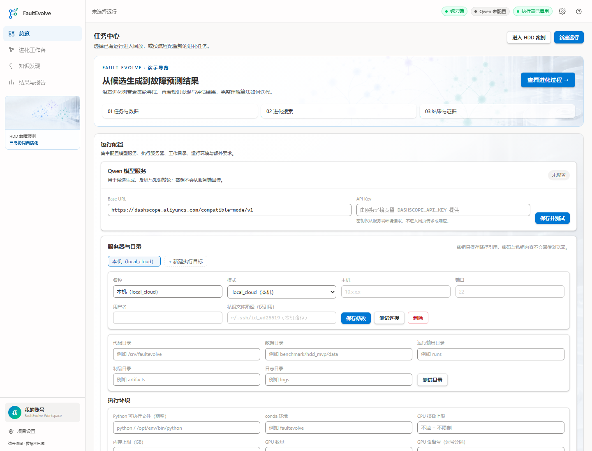
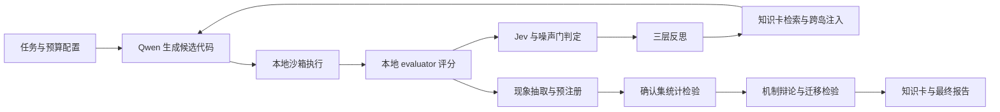
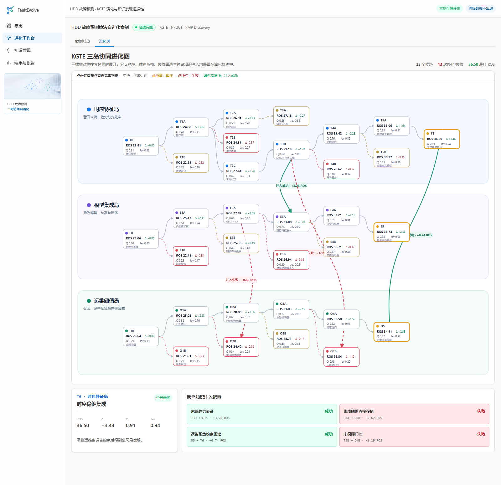
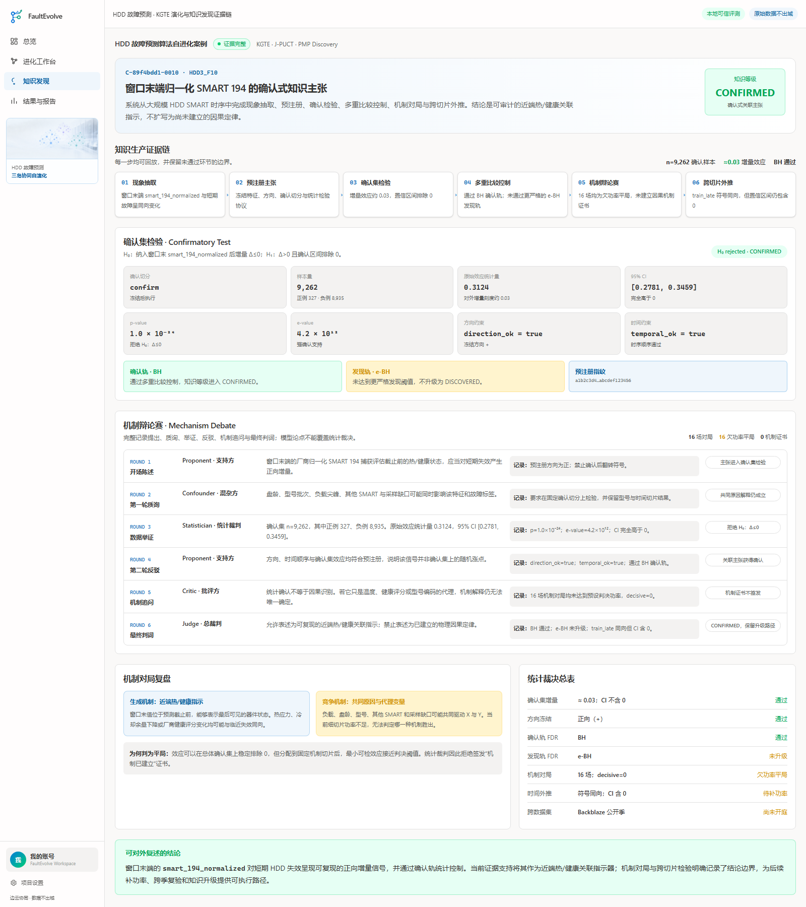
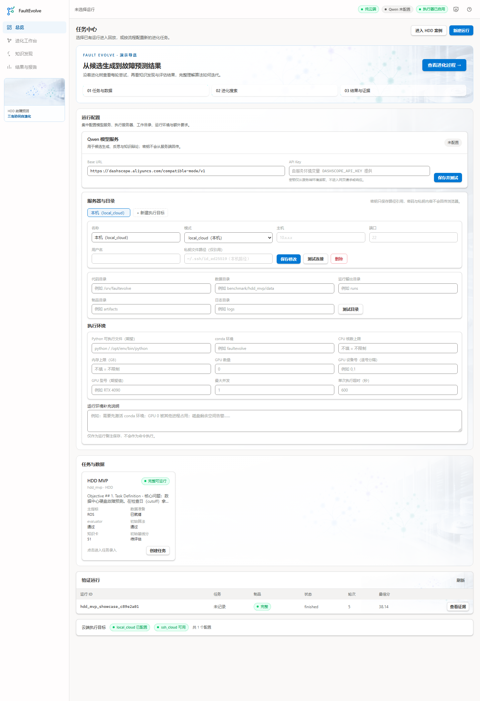
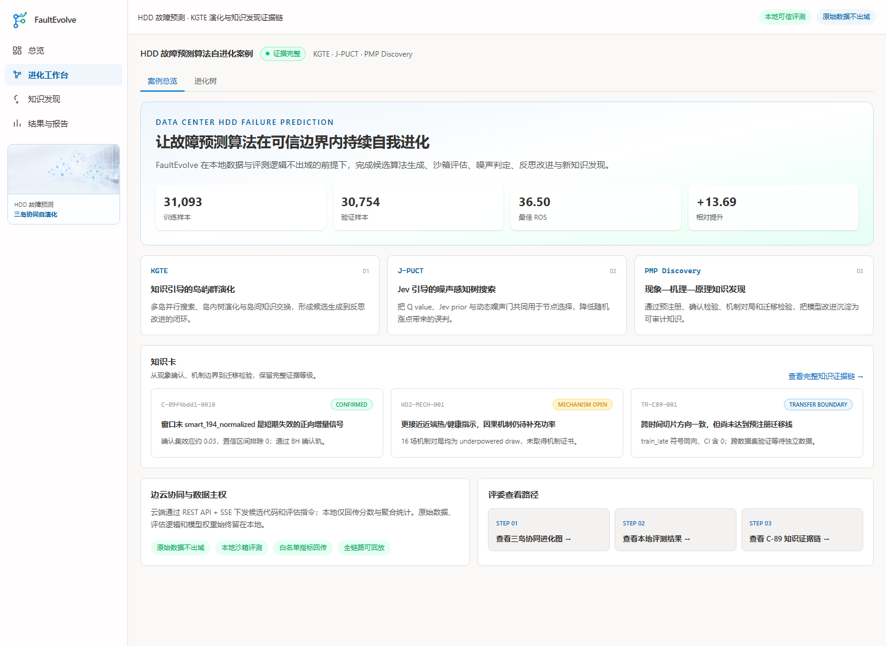
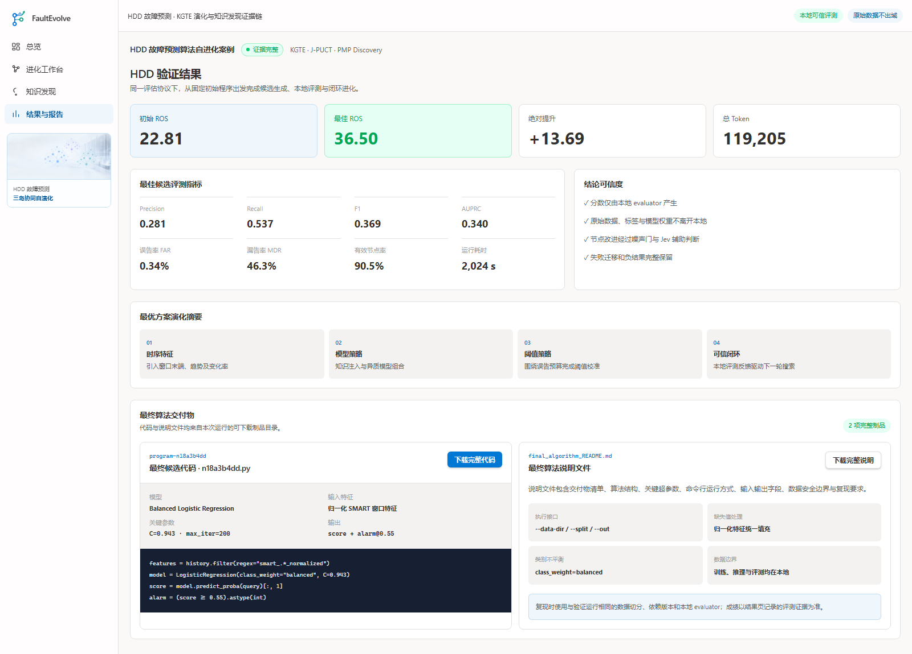
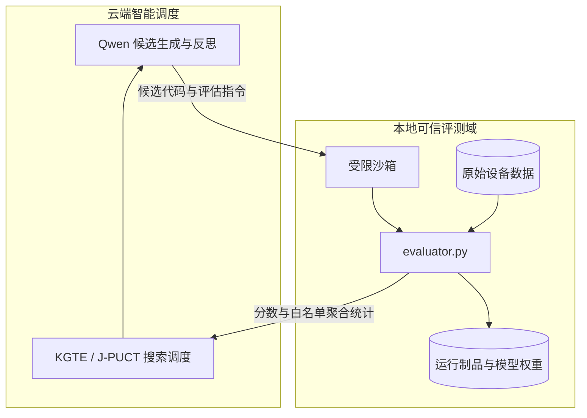

# FaultEvolve · 自演化故障预测智能体

> 面向数据中心设备故障预测的算法自进化与知识发现系统  
> 参赛方向：基于大模型 Agent 的器件故障预测算法及自动化调优

FaultEvolve 让 AI Agent 在可信评测闭环中自动完成候选算法生成、本地沙箱评估、噪声判定、反思改进和新知识发现。系统面向硬盘 SMART、SSD 健康状态和内存错误日志等可靠性场景，目标是同时交付**可运行的预测算法、可解释的进化轨迹和可审计的知识结论**。



## 1. 项目解决什么问题

器件故障样本稀少、评估波动大，传统调优依赖专家手工构造特征。一次指标上涨可能来自真实改进，也可能只是随机波动。常见 AutoML 系统通常只给出最优参数或模型，难以回答：

- 为什么这次改进有效？
- 换一个设备型号或时间切片后是否仍然成立？
- 哪些失败方向应被记录，避免重复试错？
- 数据不能上传云端时，大模型如何参与算法研发？

FaultEvolve 将算法优化组织成一条可回放的证据链：



原始数据、评估逻辑和模型权重始终留在本地。云端仅接收候选代码、任务说明和白名单聚合指标。

## 2. 三项核心创新

### 2.1 KGTE：知识引导的岛屿群演化

多个岛屿并行探索不同策略：时序特征、模型集成、运维阈值等。每个岛内部进行树搜索，岛屿之间允许知识注入。成功迁移进入后续候选，失败迁移也会保存为否证记忆。



图中每个节点直接展示 ROS、相对改进、Q 值和 Jev 结果。节点深度与分支数量由真实搜索过程决定；绿色连线表示知识注入成功，红色虚线保留失败案例。点击任意节点可查看候选判定和注入记录。

### 2.2 J-PUCT：Jev 引导的噪声感知树搜索

J-PUCT 将候选的价值估计、Jev 先验和动态噪声阈值共同用于节点选择。只有超过噪声带的改进才会被优先传播，从而减少把随机涨点当成有效进步的情况。

每个节点保留：

- 父子关系和生成算子；
- 本地 evaluator 输出的指标；
- Q 值、Jev 评分和噪声门结果；
- 候选代码差异、反思和知识卡来源；
- 成功、取消、失败和跨岛迁移状态。

### 2.3 PMP Discovery：现象 → 机理 → 原理的知识发现

系统把算法进化中出现的规律转化为可检验主张，并通过预注册、确认集、置信区间、多重比较控制、机制对局和跨切片迁移逐层升级。



内置 HDD 案例展示了 `C-89f4bdd1-0010 / HDD3_F10` 的完整证据链：窗口末端的 `smart_194_normalized` 对短期失效呈正向增量信号。确认集包含 9,262 个样本，置信区间排除 0，并通过 BH 确认轨；由于更严格的 e-BH 发现轨和机制证书条件未全部满足，知识等级保持为 **CONFIRMED**。系统保留结论边界，不把统计关联升级为已确定的因果定律。

## 3. 产品功能

### 3.1 总览与运行配置

首页集中提供：

- Qwen Base URL 与 API Key 配置；
- 本机、SSH 服务器与工作目录配置；
- 数据目录、运行输出目录和执行环境限制；
- Python / Conda 环境、CPU / GPU、内存和超时预算；
- 任务选择、历史运行和 HDD 展示入口。



### 3.2 HDD 案例总览

选择 HDD 案例后，可查看样本规模、核心创新、知识卡片、边云协同边界以及评委查看路径。



### 3.3 结果与算法交付

结果页展示初始分、最佳分、完整分类指标、演化策略摘要以及最终算法交付物。内置展示运行记录的最佳 ROS 为 **36.50**，由本地 evaluator 生成。



评委可直接下载：

- 最终候选 Python 代码；
- 最终算法说明文件；
- 可追溯的运行摘要、进化树和知识发现制品。

## 4. 快速体验 Web 界面

### 4.1 环境要求

| 组件 | 版本 |
|---|---|
| Python | 3.12 或更高 |
| Node.js | 22 或更高 |
| pnpm | 9.15 或更高 |
| 操作系统 | Windows / Linux / macOS |

内置 HDD 展示运行无需 API Key，也无需准备原始数据。

### 4.2 安装后端

在仓库根目录执行：

```bash
python -m venv .venv
```

Windows PowerShell：

```powershell
.\.venv\Scripts\Activate.ps1
python -m pip install --upgrade pip
pip install -e ".[web]"
python scripts/showcase_serve.py --port 8011
```

Linux / macOS：

```bash
source .venv/bin/activate
python -m pip install --upgrade pip
pip install -e ".[web]"
python scripts/showcase_serve.py --port 8011
```

后端启动后，API 地址为 `http://127.0.0.1:8011`。展示服务会把只读运行制品复制到系统临时目录，不会修改仓库内容。

### 4.3 启动前端

打开第二个终端：

```bash
cd web
pnpm install --frozen-lockfile
```

Windows PowerShell：

```powershell
$env:VITE_API_PROXY_TARGET="http://127.0.0.1:8011"
pnpm dev -- --port 4319
```

Linux / macOS：

```bash
VITE_API_PROXY_TARGET=http://127.0.0.1:8011 pnpm dev -- --port 4319
```

浏览器访问：<http://127.0.0.1:4319>

### 4.4 推荐演示路径

1. **总览**：查看 Qwen、服务器、目录和执行环境配置。
2. 点击 **进入 HDD 案例**，查看核心创新和知识卡。
3. 打开 **进化树**，点击不同节点，观察 Q 值、Jev、涨点和失败分支。
4. 查看三棵树之间的成功注入和失败回退。
5. 打开 **知识发现**，依次查看确认集统计结果和六轮机制辩论。
6. 打开 **结果与报告**，查看完整指标并下载最终代码和说明。

## 5. 运行自己的进化任务

### 5.1 配置 Qwen

复制环境变量模板：

```bash
cp .env.example .env
```

Windows PowerShell 可使用：

```powershell
Copy-Item .env.example .env
```

在 `.env` 中填写：

```dotenv
DASHSCOPE_API_KEY=your_api_key
```

也可以在首页“Qwen 模型服务”区域设置兼容 OpenAI 协议的 Base URL。不要把真实密钥提交到 Git。

### 5.2 检查任务

```bash
fe doctor --task-dir benchmark/hdd_mvp --env-file .env
```

任务目录采用标准四件套：

| 文件 | 作用 |
|---|---|
| `problem.md` | 任务目标、指标和约束 |
| `prompt.md` | 候选生成提示 |
| `init.py` | 初始候选算法 |
| `evaluator.py` | 本地评估逻辑 |

### 5.3 无密钥冒烟运行

```bash
fe evolve local benchmark/hdd_mvp --mock --iterations 5
```

### 5.4 使用 Qwen 进行真实进化

```bash
fe evolve local benchmark/hdd_mvp \
  --env-file .env \
  --iterations 10
```

运行制品默认写入任务目录下的 `.fe/runs/`，也可通过以下环境变量调整：

```dotenv
FE_RUNS_DIR=/path/to/local/runs
FE_ARTIFACTS_DIR=/path/to/artifacts
```

单次运行通常包含：

```text
<run-id>/
├── run_summary.json       # 运行摘要与最佳候选
├── tree.json              # 完整进化树
├── events.jsonl           # 生成、评估、反思事件
├── programs/              # 候选程序
└── discovery/             # 预注册、主张、机制与知识卡
```

### 5.5 切换数据集

仓库包含 HDD、Backblaze HDD、阿里 SSD 和 SmartMem 任务适配器。切换任务时需要同时核对数据格式、标签口径、时间切分和 evaluator，不能只替换数据路径。

```text
benchmark/
├── hdd_mvp/
├── backblaze_hdd/
├── ssd_alibaba/
└── smartmem/
```

## 6. 边云协同与数据安全



- 原始数据不上传；
- 标签、评估代码和模型权重不离开本地；
- 下载只能通过后端签发的制品 ID；
- 受保护的数据文件和 holdout 不开放下载；
- UI 展示的成绩来自运行制品，不在前端重新计算。

## 7. 仓库结构

```text
FaultEvolve-ResearchAssistant/
├── README.md                 # 对外项目文档与使用指南
├── pyproject.toml            # Python 包与 fe CLI
├── requirements.txt
├── src/faultevolve/          # 演化、评估、发现与 Web API
├── web/                      # React + TypeScript 前端
├── benchmark/                # 数据集适配器与任务定义
├── skill/                    # 可复用 Agent Skills
├── showcase/runs/            # HDD 可回放展示制品
├── scripts/showcase_serve.py # 一键启动展示后端
└── docs/screenshots/         # 对外界面截图
```

提交仓库已移除内部开发计划、阶段性 TODO、历史调试文档、本机缓存、虚拟环境、依赖缓存和未使用的设计草稿。

## 8. 常见问题

### 页面提示无法打开运行

确认展示后端仍在运行，并检查：

```text
http://127.0.0.1:8011/api/meta
```

随后确认前端终端中的 `VITE_API_PROXY_TARGET` 指向同一端口。

### 前端端口被占用

换一个端口启动：

```bash
pnpm dev -- --port 4320
```

### Qwen 状态显示未配置

内置展示不依赖 Qwen。真实进化需要配置 `DASHSCOPE_API_KEY`，或在首页填写兼容协议的 Base URL 与密钥。

### 本地任务无法启动

先执行：

```bash
fe doctor --task-dir benchmark/hdd_mvp --env-file .env
```

根据检查结果补齐 Python 环境、数据目录和任务四件套。

### 如何核对知识结论

打开 `showcase/runs/hdd_mvp_showcase_c89e2a01/discovery/`，重点查看：

- `phenomena.json`：主张、效应与判级；
- `preregistration.json`：预注册约束；
- `discovered_cards.snapshot.jsonl`：知识卡快照；
- `tournament_results.json`：机制对局结果。

## 9. 技术栈

- **Agent 与后端**：Python、Typer、Pydantic、FastAPI
- **算法与评估**：NumPy、Pandas、scikit-learn、LightGBM、SciPy
- **大模型**：Qwen / DashScope，兼容 OpenAI API 协议
- **前端**：React 19、TypeScript、Vite、Tailwind CSS、XYFlow
- **实时通信**：REST API + SSE
- **运行制品**：JSON / JSONL / SQLite / Python 程序

## 10. 许可证

本项目代码按 `pyproject.toml` 声明采用 MIT License。比赛数据及第三方依赖分别遵循其原始许可和使用条款。
