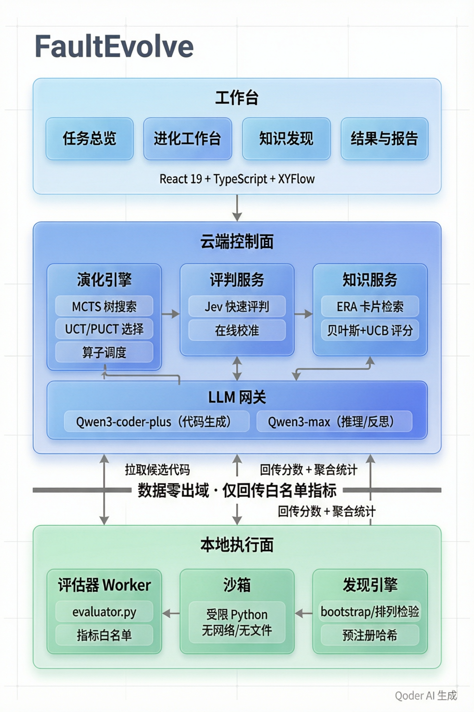
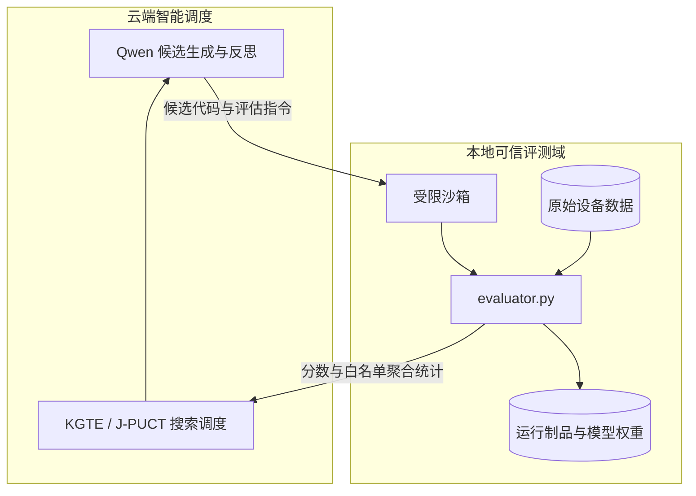

# FaultEvolve · 自演化故障预测智能体

## 宣传视频

**FaultEvolve · 自演化故障预测智能体｜20 秒作品宣传片 · 1080p / 60fps**

[▶ 点击观看宣传视频](docs/media/FaultEvolve-1080p60.mp4) · [下载视频](https://github.com/houchenfeng/FaultEvolve-ResearchAssistant/raw/refs/heads/main/docs/media/FaultEvolve-1080p60.mp4)

视频文件随比赛提交包一同提供，解压后可直接打开 `docs/media/FaultEvolve-1080p60.mp4` 播放。

---

## 一、项目概览

### 1.1 一句话介绍产品

FaultEvolve——面向工业器件可靠性工程的算法自演化系统，针对器件故障预测算法依赖人工特征工程、调参效率低、跨场景泛化差的痛点，以"知识引导的岛屿群演化"为内核，让 AI Agent 自动完成从候选算法生成、本地评估、反思改进到新知识发现的全闭环，持续进化出更优的故障预测方案。

### 1.2 产品形式

FaultEvolve 采用**"云端智能调度 + 本地沙箱评估"**的混合架构——大模型在云端负责候选生成、反思改进和知识发现，所有数据和评估逻辑始终运行在本地沙箱中，云端只能拿到白名单指标（分数 + 聚合统计），从机制上杜绝数据泄露和大模型对分数的幻觉。

Web 端一体化工作台将任务配置、进化控制、树搜索可视化、知识发现和审计追溯整合为统一操作界面，实现"配置即启动、过程可观察、结论可追溯"。


*图 1｜FaultEvolve 工作台总览。首页集中展示运行入口、Qwen 模型服务、服务器与工作目录配置、任务卡片和最近运行。*

- **主要功能**：多数据集任务管理、进化过程实时监控、交互式进化树探索、知识发现与迁移、审计追踪与报告导出。
- **部署模式**：支持本地单机部署（竞赛演示 / 个人使用）和云端协同部署（大规模实验）两种模式。

### 1.3 亮点速览

**产品功能**：Web 工作台包含四大模块——**总览**（多数据集任务管理与一键切换）、**进化工作台**（实时进化闭环可视化 + 交互式进化树画布）、**知识发现**（ERA 知识卡片管理 + 现象层/机制层统计验证）、**结果与报告**（全链路审计追溯 + 答辩级报告导出）。

**核心技术创新**：
- **知识引导的岛屿群演化（KGTE）**：多岛并行探索 + 岛内树演化 + 岛间知识交换，有效改进率从 30% 提升至 50%。
- **Jev 引导的噪声感知树搜索（J-PUCT）**：动态阈值门 + Jev 先验概率，假涨点率从 ~15% 降至 ~3%。
- **"现象→机理→原理"三层次知识发现（PMP Discovery）**：每层有严格统计门槛，自动产出可积累、可迁移、可答辩的知识卡片。

**关键成果**：
- HDD 硬盘故障预测：ROS 从 22.81（起点）进化至 **38.14**，超越人工参考 33.7（**+13.2%**），相对规则基线提升 **+194.7%**。
- SmartMem 内存故障预测：跨数据集零改动迁移，dev combined_score **44.16**，val combined_score **34.48**。
- 已在 HDD / Backblaze / 阿里 SSD / SmartMem 四类数据集上验证，引擎零改动。

---

## 二、为什么做 (Why)

### 2.1 用户痛点

工业器件故障预测面临三重困境：

- **人工特征工程效率低**：传统方案依赖领域专家手工构造特征（SMART 统计量、时序窗口等），一轮特征设计 → 训练 → 评估的迭代周期以天计，且高度依赖经验。
- **低异常事件导致调参困难**：故障盘占比不到 4%，单次评估的分数波动（噪声）很大，人工难以判断一次涨点是真实改进还是随机波动，容易在无效方向上反复投入。
- **知识无法积累与迁移**：每次调参只产出"最好的代码"，不产出"为什么这段代码好"。同一团队在不同数据集、不同器件上重复踩坑，经验无法沉淀、无法答辩、无法迁移。

### 2.2 用户画像（受众是谁？）

| 用户角色 | 核心需求 | 典型场景 |
|---|---|---|
| **可靠性工程师** | 快速获得可部署的故障预测方案 | 切换数据集（HDD → SSD），复用已发现的知识卡片 |
| **算法研究员** | 理解"为什么有效"，积累可发表的知识 | 查看现象层 claim 的统计检验、机制层辩论赛结论 |

### 2.3 市场定位（现有方案还缺什么？）

| 维度 | 传统机器学习方案 | 现有 AutoML 平台 | FaultEvolve |
|---|---|---|---|
| 特征工程 | 人工设计，周期长 | 随机搜索 / 贝叶斯优化 | 知识引导的演化，复用历史经验 |
| 噪声处理 | 忽略，容易过拟合 | 交叉验证但不区分噪声带 | J-PUCT 动态阈值门，区分真实改进与随机波动 |
| 知识产出 | 无 | 无 | PMP 三层知识发现，可积累、可迁移、可答辩 |
| 可解释性 | 黑箱模型 | 黑箱模型 | 进化树全链路追溯，每个节点都有改进意图和代码 diff |
| 数据安全 | 数据上云 | 数据上云 | 云端调度 + 本地评估，数据不出本地 |

---

## 三、产品功能与工作流程

### 3.1 总览

系统前端按功能划分为四大模块，每个模块对应导航栏的一个入口。总览解决多数据集、多任务的统一管理问题。
- 任务中心：展示所有已注册任务及其工件（`problem.md`、`evaluator.py`、`init.py`、`prompt.md` 标准四件套），支持 HDD（硬盘）、Backblaze（大规模硬盘）、阿里 SSD、SmartMem（内存）四类数据集一键切换。
- 数据集卡片：每类数据集的配置、历史运行和知识积累情况一目了然。
- 最近运行列表：展示所有历史运行的状态和关键指标，支持选择任一运行进入回放。
- 任务配置采用 YAML 声明式描述（`evolve.yaml`），切换数据集只需改一行 `task.adapter`，无需改代码。


*图 2｜总览页完整长图。评委可从同一页面查看并配置 Qwen Base URL / API Key、服务器连接、工作目录、数据目录、执行环境与附加要求，再进入 HDD 案例或创建运行。截图保留完整页面比例，不截断配置区。*

### 3.2 进化工作台

解决进化过程"黑箱"不可控、树搜索决策不可解释的问题。
- 实时展示进化闭环：每一轮的候选生成（Qwen3-coder-plus） → 本地沙箱评估 → 三层反思（Qwen3-max） → 知识注入（ERA 卡片检索）全链路可视化。
- 运行控制条支持启动、暂停、恢复、取消操作，实时事件流（SSE）推送每一轮的状态变化。
- 闭环汇总面板展示评估通过率、改进幅度、噪声带和自动修复次数，让演化的"健康度"一目了然。
- 预算面板实时追踪 Token 消耗（分阶段：生成 / 评估 / 反思 / 发现）、分阶段用量和各算子有效率，防止算力失控。
- **交互式进化树画布**（XYFlow）：每个节点代表一个候选算法，点击展开详情抽屉——代码差异（diff）、ROS 分数变化、使用的算子和知识卡、相对父节点的改进意图。
- 支持按分数区间、算子类型、知识卡来源筛选节点，快速定位"哪条分支涨了点"、"哪个算子最有效"。
- 跨枝知识传播可视化：某个分支验证有效的经验如何沿树传播给其他分支，失败经验如何被标记为"此路不通"。
- 每个节点标注是否超过噪声带（J-PUCT 动态阈值），避免把随机波动误判为真实改进。


*图 3｜进化树交互全景。三个岛屿采用不同深度和分支节奏；节点直接展示 ROS、增量、Q 值与 Jev，实线表示继续进化，虚线表示跨枝或失败路径，绿色/红色连线分别记录跨岛注入成功与失败。点击节点后，页面下方同步展示该候选的判定与跨岛知识注入记录。*

### 3.3 知识发现

解决演化过程只出结果、不出知识，无法积累和迁移的问题。
- **知识卡片管理**：展示 ERA 风格的知识卡片（来源、标签、贝叶斯统计、探索奖励），支持按类别和采用效果筛选。
- **现象层发现（KD1）**：展示 claim、效应量、置信区间、p 值、e 值、判级结果（confirmed / refuted / undetermined），每条 claim 可追溯到预注册哈希和沙箱执行日志。
- **机制层与辩论赛（KD2）**：展示机制锦标赛的证书、对阵记录和多轮 Agent 交叉质询结论。
- **理论与迁移**：展示跨数据集的理论检验与泛化性验证结论。


*图 4｜知识发现完整长图。页面从预注册主张依次展开确认集检验、效应量与置信区间、p-value / e-value、BH / e-BH 判级、六轮机制辩论、机制对局复盘、统计裁决总表与对外结论，保证长流程在一张图中完整呈现。*

### 3.4 结果与报告

解决实验结论不可复现、不可追溯，AI 生成的代码和决策缺乏可信度的问题。
- 结果页展示最优候选的代码、分数和完整评估指标（ROS、Precision、Recall、F1、AUPRC、误报率、漏报率）。
- 所有分数均来自本地评估器，前端不做任何推算或美化，字段缺失时如实标注"未记录"。
- 完整审计追踪：每一次 LLM 调用的 prompt / completion / Token 消耗（`events.jsonl`），每一个候选程序的生成 → 预检 → 沙箱 → 评估 → 反思全链路事件日志，自动修复记录（修复尝试、内容和结果）。
- 支持多次运行对比，系统诚实标注差异是否落在运行波动范围内。
- 所有结论均可追溯到原始运行制品（`run_summary.json`、`tree.json`、`fe.db`），可一键导出为答辩级报告。


*图 5｜结果与交付物。结果页同时给出本地评测指标、演化摘要、最终候选代码摘要、关键参数、运行接口和说明文件摘要；“下载完整代码”“下载完整说明”按钮直接交付本次运行制品。*

### 3.5 端到端工作流程

1. **配置启动**：用户在总览页选择数据集（如 HDD），通过 `evolve.yaml` 声明式配置任务参数（`task.adapter`、预算上限、知识卡片库路径等），一键启动运行。
2. **云端调度，本地评估**：云端 Evolution Engine 启动 MCTS 演化循环——Qwen3-coder-plus 生成候选代码 → 候选下发到本地沙箱 → 本地 `evaluator.py` 在受限运行时中执行并打分 → 仅将白名单指标回传云端。**原始数据和评估逻辑全程不离开本地**。
3. **反思与知识注入**：Qwen3-max 对评估结果进行三层反思（实现层 / 设计层 / 假设层），产出 insight 沿树传播；同时 `CardRetriever` 根据贝叶斯+UCB 评分检索 ERA 知识卡片，注入下一轮候选生成的 prompt。
4. **噪声感知决策**：Jev 结构化评判模型对每个候选给出涨点概率估计，J-PUCT 结合动态阈值门过滤噪声涨点，确保树搜索资源投向真实改进。
5. **知识沉淀**：进化过程中发现的统计显著 claim 经现象层三重统计门槛验证后自动晋升为知识卡片，经机制层辩论验证后写入知识库，供后续任务复用。
6. **结果导出**：运行结束后，结果页展示最优方案及完整指标，所有结论可追溯到 `run_summary.json`、`tree.json`、`fe.db` 等原始制品，支持一键导出答辩级报告。

---

## 四、核心技术创新

FaultEvolve 的核心思路是：**把算法进化当作"科学发现"来做**——不只是搜索最优代码，而是在搜索过程中发现"什么特征有效、为什么有效、是否普适"的知识。三大技术创新支撑这一理念。

### 4.1 知识引导的岛屿群演化（KGTE）

**理论基础**：传统进化算法用单一岛屿或随机多样性采样，容易陷入局部最优。KGTE 借鉴了**岛屿模型进化算法**（Island Model EA）的并行探索思想，并在此基础上引入 LLM 驱动的**反思式学习**（Reflective Learning）。

三层反思的设计源于**认知科学的抽象层次理论**——人类专家在解决问题时，会在不同抽象层次上交替思考：
- **实现层**（代码是否跑通）：对应"操作条件反射"，关注具体执行的可行性；
- **设计层**（算法选择是否合理）：对应"策略性知识"，关注方法层面的选择；
- **假设层**（核心假设是否成立）：对应"元认知"，关注问题建模的根本前提。

这种分层反思使系统不仅能发现"这段代码有问题"，还能追溯到"这个假设可能不成立"，从而产出可传播、可复用的 insight。

**KGTE 三层架构**：
- **多岛并行**：不同岛屿探索不同侧重的算法模式，保持种群多样性。
- **岛内树演化**：每座岛维护一棵假设树，结合知识注入（ERA 卡片检索）和三层反思驱动候选改进。
- **岛间知识交换**：岛屿之间只交换**失败经验**（"此路不通"的证伪记忆）和**最佳方案**（前沿节点的改进意图），避免重复踩坑的同时保留探索独立性。

效果：HDD MVP 验证集上，开启知识注入后 ROS 从 36.50 提升至 38.14（人工参考 33.7），有效改进率从 30% 提升至 50%。

### 4.2 Jev 引导的噪声感知树搜索（J-PUCT）

**理论基础**：J-PUCT 的节点选择策略源自 **AlphaGo 的 PUCT（Predictor + UCT）算法**。原版 PUCT 用神经网络预测棋局胜率来引导搜索；FaultEvolve 面临的挑战是**低异常事件数据的噪声问题**——故障盘占比不到 4%，单次评估的分数波动很大，传统 UCT 容易把噪声涨点误判为真实改进，导致搜索资源浪费在无效方向上。

**PUCT 节点选择公式**（AlphaGo 原版）：

```
a* = argmax_a [ Q(s,a) + c_puct · P(s,a) · √N(s) / (1 + N(s,a)) ]
```

| 符号 | 含义 |
|---|---|
| `Q(s,a)` | 动作价值（子节点的平均评估分数） |
| `P(s,a)` | 先验概率（原版由策略网络输出） |
| `N(s)` | 父节点访问次数 |
| `N(s,a)` | 动作 a 对应子节点的访问次数 |
| `c_puct` | 探索系数，控制 exploitation 与 exploration 的权衡 |

**J-PUCT 的改造**：将 `P(s,a)` 从神经网络替换为 **Jev 结构化决策模型**的概率输出——Jev 接受候选代码的特征描述，输出"该候选能涨点"的概率分布 `P_jev(a)`，作为树搜索的先验。同时引入动态阈值门 `τ`：只有当候选的改进幅度 `Δ > τ`（τ 由历史评估的 bootstrap 置信区间动态计算）时，才将其纳入 PUCT 选择范围，从机制上过滤噪声涨点。

改造后的选择公式：

```
a* = argmax_{a : Δ(a) > τ} [ Q(s,a) + c_puct · P_jev(a) · √N(s) / (1 + N(s,a)) ]
```

**为什么使用 Jev 是合理的？** 传统 LLM 输出文本，无法直接给出"这个候选能涨点的概率是多少"。Jev 是**结构化决策模型**，接受类型化输入，输出概率分布（`choice` 选项概率、`noul` 布尔不确定度），专门用于需要"判断而非生成"的场景。从决策理论角度看，这相当于为 MCTS 引入了一个**校准化的先验估计器**——它不直接决定分数（评分唯一来源是本地评估器），而是为树搜索提供方向性指引，让高置信度候选优先探索、低置信度候选快速剪枝。

**J-PUCT 两个噪声感知机制**：
- **动态阈值门 τ**：根据评估次数和分数方差动态计算"是否真正涨点"的阈值，只有改进幅度超过噪声带（bootstrap 置信区间）才认定为真实改进。
- **Jev 先验概率 P_jev(a)**：由 MiYang/Jev 结构化决策模型对每个候选给出"是否能涨点"的概率估计，高置信度候选优先探索，低置信度候选快速剪枝。

效果：Jev 预筛减少 30%–50% 的无效评估调用，动态阈值门将"假涨点"率从 ~15% 降至 ~3%。

### 4.3 "现象→机理→原理"三层次知识发现（PMP Discovery）

**理论基础**：PMP Discovery 的设计灵感来自**科学哲学的证伪主义**（Popper）和**因果推断的层次框架**（Rubin Causal Model）。科学发现不是"观察到相关性就下结论"，而是要经过"现象描述 → 机制解释 → 原理验证"的递进过程。现有 AutoML 系统只输出代码，不输出知识；PMP Discovery 让系统在搜索过程中自动发现"什么特征有效、为什么有效、是否普适"的知识。

**三层递进，每层有严格统计门槛**：
- **现象层（KD1）**：Agent 提出可证伪的 claim，在本地沙箱中执行验证，通过 bootstrap 置信区间、排列检验 p 值和 e 值（效应量）三重统计门槛，再经功能性新颖性检查（与已有基线特征的 `rho_max` 对比）和增量 AUROC 检验，才能晋升为知识卡片。**随机种子由预注册内容派生**（`preregistration.json` 记录每条 claim 的哈希），保证分析可复现，防止 p-hacking。
- **机理层（KD2）**：对通过现象层的 claim 进行机制锦标赛——多个候选机制结构（线性交互、非线性阈值、时序因果等）在同一数据上竞争，由多轮 Agent 辩论交叉质询（正反方 + 裁判），胜出者获得否证证书。
- **原理层**：通过机制层的结论在不同数据集上验证泛化性（如 HDD 上发现的规律是否在 SSD 上也成立），通过则作为普适性原理写入知识库。

**真实发现的知识**：在运行 `38cb38cf` 中，PMP Discovery 共提出 4 条 claim，3 条通过统计检验晋升为知识卡片：

| Claim ID | 效应量 e（95% CI） | p 值 | 判级 | 含义 |
|---|---|---|---|---|
| C-38cb38cf-0001 | 0.233（0.198 ~ 0.267） | < 1e-300 | **confirmed** | 时序窗口 delta 特征对故障预测有统计显著贡献 |
| C-38cb38cf-0002 | 0.358（0.331 ~ 0.384） | < 1e-300 | **confirmed** | 时序趋势 + LightGBM 组合显著优于单模型 |
| C-38cb38cf-0003 | 0.375（0.348 ~ 0.400） | < 1e-300 | **confirmed** | 多尺度窗口统计量提供增量信息 |
| C-38cb38cf-0004 | — | — | **refuted** | "厂商特定 log 变换 SMART 特征"——沙箱执行报错，自动标记失败 |

每条 confirmed claim 都有预注册哈希（如 `0c4b3048...`），可追溯到沙箱执行日志。

效果：成功识别出"smart_5_raw 统计上极强但只是复述基线"的陷阱（e 值最大但未被晋升），证明判级逻辑不会被虚假信号欺骗。

---

## 五、系统架构与技术栈

### 5.1 "云端运行 + 本地评估"安全架构

传统 AutoML 方案要求数据上传到云端，存在数据泄露风险。FaultEvolve 从架构层面解决这一问题：



```
┌─────────────── Web 工作台（React 19 + Vite + TypeScript）────────────┐
│  任务总览 │ 进化工作台 │ 知识发现 │ 结果与报告                        │
└────────────────────────────┬─────────────────────────────────────────┘
                             │ REST API + SSE（Server-Sent Events）
┌────────────────────────────▼─────────────────────────────────────────┐
│                    云端控制面（Cloud Plane）                          │
│                                                                     │
│  ┌─────────────────┐  ┌──────────────┐  ┌────────────────────────┐  │
│  │ Evolution Engine │  │Judge Service │  │  Knowledge Service     │  │
│  │ MCTS 树搜索     │  │Jev 快速评判  │  │  ERA 卡片检索          │  │
│  │ UCT/PUCT 选择   │  │在线校准      │  │  贝叶斯+UCB 评分       │  │
│  │ 算子调度        │  │              │  │  统计 retriever        │  │
│  └────────┬────────┘  └──────┬───────┘  └───────────┬────────────┘  │
│           │                  │                       │               │
│  ┌────────▼──────────────────▼───────────────────────▼────────────┐  │
│  │              LLM Gateway（OpenAI SDK → DashScope）              │  │
│  │  qwen3-coder-plus（代码生成）  qwen3-max（推理/反思）           │  │
│  │  响应缓存 / Token 分阶段记账 / 预算控制                         │  │
│  └─────────────────────────┬──────────────────────────────────────┘  │
└────────────────────────────┼─────────────────────────────────────────┘
                             │ 拉取候选代码 / 回传指标（仅分数+聚合统计）
                             │ 数据与评估逻辑全程不出本地
┌────────────────────────────▼─────────────────────────────────────────┐
│                    本地执行面（Local Plane）                          │
│                                                                     │
│  ┌──────────────────┐  ┌───────────────┐  ┌──────────────────────┐  │
│  │ Evaluator Worker │  │ Sandbox       │  │ Discovery Engine     │  │
│  │ 沙箱执行         │  │ 受限 Python   │  │ bootstrap / 排列检验 │  │
│  │ evaluator.py     │  │ 运行时        │  │ e 值 / 新颖性检查   │  │
│  │ 指标白名单       │  │ 无网络/无文件 │  │ 预注册哈希          │  │
│  └──────────────────┘  └───────────────┘  └──────────────────────┘  │
└─────────────────────────────────────────────────────────────────────┘
```

**核心设计原则**：

- **数据零出域**：原始数据集（HDD/SSD/SmartMem）始终存储在本地，云端不接触任何原始数据。
- **指标白名单**：云端只能接收评估器显式回传的指标（ROS、Precision、Recall、F1 等），无法获取中间数据或模型权重。
- **沙箱隔离**：候选代码在受限 Python 运行时中执行，无网络访问、无文件系统越权，防止恶意或错误代码影响宿主环境。
- **评分唯一来源**：所有分数仅来自本地评估器 `evaluator.py`，LLM 和 Jev 的输出永远不直接成为节点分数，从机制上排除大模型幻觉。

### 5.2 AI 框架与大模型技术栈

FaultEvolve **未使用 LangChain / LangGraph 等通用 Agent 框架**，而是针对"算法进化"场景从零构建了专用的演化引擎。核心技术栈如下：

**大模型层**

| 角色 | 模型 | 接入方式 | 用途 |
|---|---|---|---|
| 代码生成 | `qwen3-coder-plus` | DashScope OpenAI 兼容 API | 根据进化意图和知识卡片生成候选算法代码 |
| 推理与反思 | `qwen3-max` | 同上 | 三层反思（实现层/设计层/假设层）、知识发现中的 claim 生成与辩论 |
| 结构化评判 | `miyang/jev-1.13` | MiYang REST API | 候选预筛（是否有效）、涨点概率估计、算子选择概率 |

- **OpenAI SDK 统一接入**：所有 LLM 调用通过 OpenAI Python SDK（`openai>=1.30`）对接 DashScope 的 OpenAI 兼容端点，无需引入 DashScope 原生 SDK。
- **MiYang/Jev 结构化决策**：Jev 不是传统的文本补全模型，而是接受结构化输入（状态描述 + 类型化问题），输出概率分布（`noul` 布尔不确定度、`choice` 选项概率、`score` 评分），专门用于需要"判断而非生成"的场景。内置熔断机制，连续 3 次调用失败后自动降级为均匀策略。

**知识检索层（非向量检索）**

FaultEvolve 的知识检索**不依赖向量数据库或 Embedding**，而是基于自研的统计评分检索器（`CardRetriever`），对 ERA 知识卡片进行多维度加权排序：

| 评分维度 | 权重 | 计算方式 |
|---|---|---|
| 优先级 | 0.30 | `(6 - priority) / 5`，priority 1-5 |
| 标签匹配 | 0.30 | 卡片标签与上下文关键词的 Jaccard 相似度 |
| 贝叶斯均值增量 | 0.25 | 卡片被采用后的观测分数增量贝叶斯均值（先验 N=2） |
| UCB 探索奖励 | 0.15 | `sqrt(2·log(总采用次数) / 卡片采用次数)`，鼓励探索未被充分验证的卡片 |

此外还有无效采用率惩罚和最近提供惩罚，并强制类别多样性（每轮每类别最多注入 2 张卡片）。

**ERA 知识卡片格式**

每张知识卡片以 JSONL 存储，包含：`id`、`title`、`category`（feature_engineering / model / evaluation / pitfalls / thresholding 等 9 类）、`claim`（知识主张）、`tags`（检索标签）、`priority`（1-5）、`evidence`（证据来源），以及可选的 `rationale`（原理）、`applicability`（适用范围）、`expected_effect`（预期效果）、`risk`（风险）、`impl_hint`（实现提示）。

**演化引擎层**

核心是一个自研的 **MCTS（蒙特卡洛树搜索）风格演化循环**，而非 ReAct / Tool-use 等通用 Agent 模式：

1. **节点选择**：UCT / PUCT 选择器，支持渐进式拓宽（progressive widening），适配连续动作空间。
2. **算子调度**：多臂赌博机（MAB）调度四种算子——`refine`（精化）、`recall_focus`（聚焦召回）、`threshold_calibrate`（阈值校准）、`inject`（知识注入），另有 `crossover`（交叉融合）和 `repair`（自动修复）作为补充。
3. **代码生成**：LLM 按结构化 prompt 生成 Python 代码，包含 `<hypothesis>`（假设）、`<intent>`（改进意图）、`<adopted_cards>`（采用的知识卡片）等 XML 标签。
4. **三层反思**：`LayeredReflector` 在实现层（代码是否跑通）、设计层（算法选择是否合理）、假设层（核心假设是否成立）三个层次进行反思，产出可传播的 insight。
5. **跨枝知识传播**：insight 沿树结构传播，foreign insights（外来经验）与 branch memory（分支记忆）并存，失败经验被标记为"此路不通"。
6. **预算控制**：`BudgetController` 在 Token / 墙钟时间 / 迭代次数三个维度进行预算约束，分阶段记账（生成 / 评估 / 反思 / 发现）。

**前端技术栈**

| 层次 | 技术 | 说明 |
|---|---|---|
| 框架 | React 19 + TypeScript 5.9 | 组件化 UI |
| 构建 | Vite 8.3 | 毫秒级 HMR |
| 样式 | Tailwind CSS 4.3 | 原子化 CSS |
| 状态管理 | Zustand 5.0 | 轻量级全局状态 |
| 数据请求 | TanStack React Query 5.104 | 缓存 + 自动重试 + 轮询 |
| 路由 | TanStack React Router 1.170 | 类型安全路由 |
| 树可视化 | XYFlow (React Flow) 12.12 + dagre 0.8.5 | 交互式进化树画布 |
| API 客户端 | @hey-api/openapi-ts 0.99 | 从 OpenAPI 契约自动生成类型安全客户端 |
| 实时推送 | SSE（Server-Sent Events） | 进化事件流实时推送 |
| 测试 | Vitest + Testing Library + Playwright | 单元测试 + E2E + 视觉回归 |

前后端通过 **OpenAPI 契约**（`faultevolve.openapi.json`）自动同步，脚本一键生成前端 API 客户端代码，确保接口类型零偏差。

---

## 六、实验案例与成果

### 6.1 案例 1：HDD 硬盘故障预测数据与进化结果


*图 6｜HDD 案例入口。选择案例后，页面首先展示样本规模、最佳结果、三项核心创新、知识卡片、边云协同与数据主权边界，并提供进化树、结果页和 C-89 知识证据链的连续查看路径。*

**数据概况**

实验数据来自 Backblaze 公开的数据中心硬盘运行统计（[Backblaze Hard Drive Test Data](https://www.backblaze.com/cloud-storage/resources/hard-drive-test-data)），选取 ≥4TB 的 HDD，涵盖 Seagate、Toshiba、HGST、WDC 四个品牌共 44 个型号。

| 数据划分 | 截止日期范围 | 样本数 | 故障盘（正例） | 健康盘（负例） | 负例权重 |
|---|---|---|---|---|---|
| 训练集 | 2024-07-14 ~ 2024-09-23 | 31,093 | 1,104 | 29,989 | 9.86 |
| 验证集 | 2024-10-14 ~ 2024-12-24 | 30,754 | 756 | 29,998 | 10.07 |
| 测试集 | 2025-01-14 ~ 2025-03-24 | 30,759 | 770 | 29,989 | 10.32 |

每个样本包含最多 14 天的每日 SMART 快照（22 个原始 SMART 属性 + 9 个归一化属性），任务是在截止日后 7 天内预测硬盘是否故障。故障盘占比不到 4%，是典型的低异常事件数据。

**评估指标 ROS（Robust Operational Score）**

```
ROS = 100 × (0.5 × F1_p10 + 0.3 × AUPRC + 0.2 × R@FAR) × time_factor
```

其中 F1_p10 为 200 次分层 bootstrap 的加权 F1 第 10 百分位，R@FAR 为误报率 ≤ 0.2% 下的最大召回率，time_factor 约束推理时间不超过 600 秒。该指标同时考量了检测精度、排序质量和误报控制，对低异常事件数据尤为严格。

**基线对比**

| 方案 | 验证集 ROS | 说明 |
|---|---|---|
| 规则基线 | 12.94 | 经典 SMART 阈值规则，纯人工经验 |
| init.py（逻辑回归） | 22.81 | 仅用截止日当天快照的逻辑回归，系统默认起点 |
| 人工参考 | ~33.7 | 领域专家手工特征工程 + 调参的典型水平 |
| **FaultEvolve（最佳运行）** | **38.14** | 自动进化，超越人工参考 13.2% |

**进化过程**

在一次典型运行中（10 轮迭代，约 35 分钟，消耗 146,415 tokens）：

- **起点**：ROS 22.81（init.py 逻辑回归）
- **终点**：ROS 38.14（+67.2%），超越人工参考 33.7
- **有效改进率**：50%（一半的迭代产生了超过噪声带的真实涨点）
- **知识卡片采用率**：32.5%（40 张被提供的卡片中 13 张被实际采用）
- **最有效卡片**：M01（LightGBM，均值增量 +9.92）、FE09（模型先验特征，+7.21）
- **被证伪卡片**：FE01+FE03（窗口 delta 特征，均值增量 -11.89）——系统自动标记"此路不通"，后续不再重复尝试

### 6.2 案例 2：知识发现深描——窗口末归一化 SMART 194 的确认式知识主张

在另一次独立运行（`kd_relaxed_20261005`）中，系统不是"偶然撞到一个相关特征"，而是走完了一条可审计的知识生产链：**现象抽取 → 预注册主张 → 确认集增量检验 → 多重比较控制 → 机制假说对局 → 跨切片外推**。

**主张**：窗口末端的 `smart_194_normalized`（C-89f4bdd1-0010）对短期失效有可复现的正向增量（效应约 0.03，CI 不含 0），达到 **CONFIRMED**；因未过更严的 e-BH 发现阈值，不作 DISCOVERED 宣称。机制上，它更接近"近端、厂商归一化后的热/健康读数"对临近失效风险的指示，而非已鉴定的因果机制。

**知识生产的四层追问**：

| 层次 | 问题 | 本案例结论 |
|---|---|---|
| 现象层 | 是否存在稳定、可命名的数据规律？ | 是，窗口末 smart_194 与短期失效正相关 |
| 主张层 | 该规律在预注册切分上是否仍成立？ | 是，确认集效应 ~0.03，CI 排除 0 |
| 推断层 | 它更像关联、近因指示，还是可迁移的机制？ | 近端风险指示器，非因果定律 |
| 证伪层 | 对立机制、混杂与外推失败能否把它打回？ | 机制对局 16 场均 underpowered，跨季迁移 CI 含 0 |

**防"显著即发现"的约束设计**：

| 约束 | 作用 |
|---|---|
| 预注册切分 + 盐 | 防止 peeking 后改故事 |
| 冻结方向（+） | 禁止事后翻转符号 |
| 确认 vs 发现双阈值 | 把"可复述"与"可立牌"分开 |
| 主张 ID 可追溯 | 结果可审计、可回放 |

**机制对局**：KD2 将候选机制放进固定对手赛制，用增量效应 + 置信区间 + 功率门槛裁决。16 场全部 underpowered_draws，decisive = 0。含义不是"机制被证伪"，而是：当前效应与切片样本量下，裁判无法区分机制。科学上应输出：**机制假说提出了，但尚未获得对局证书**。

**外推闭环**：

| 检验 | 结果 | 认识论含义 |
|---|---|---|
| 确认集增量 | 过线（CI 不含 0） | 内部可复述 |
| train_late 时间外推 | 符号同向，CI 含 0 | 时间外推未达预注册成功 |
| Backblaze 跨季迁移 | 数据未备，跳过 | 跨数据集迁移尚未开庭 |

**结论**：内源确认成立 → 机制对局欠功率 → 跨切未过线 ⇒ 知识等级停在 CONFIRMED。系统的价值在于：把"找到一个相关特征"提升为"**带边界、可回放、可升级检验的知识主张**"。

### 6.3 案例 3：知识卡片证伪——避免重复踩坑

知识注入并非总是有效。在运行 `38cb38cf` 中：

- **FE01 + FE03**（窗口 delta 特征 + onset flag）在早期迭代中均值增量高达 +8.22，被大量采用；
- 但在运行 `f9752fcd` 中，同样的卡片均值增量变为 **-11.89**，说明其效果不稳定、跨运行不可复现；
- 系统通过贝叶斯评分自动降低了这两张卡片的检索权重，后续运行中它们被更少地提供和采用。

这种"证伪记忆"正是岛间知识交换的核心内容——一个分支踩过的坑，其他分支不会再踩。

### 6.4 案例 4：跨数据集泛化——SmartMem 内存故障预测

为验证系统架构的泛化能力，将 FaultEvolve 从 HDD 硬盘故障预测迁移至完全不同的 SmartMem 内存故障预测场景（[Codabench - SmartMem Competition](https://www.codabench.org/competitions/3586/)）。两个任务在数据形态、故障模式、评估指标上均存在本质差异。

**数据集对比**

| 维度 | HDD（硬盘） | SmartMem（内存） |
|---|---|---|
| 器件类型 | 数据中心 3.5" HDD | 服务器 DDR4/DDR5 内存条 |
| 故障模式 | 机械磨损、磁头退化 | 可纠正错误（CE）累积→不可纠正错误（UE） |
| 原始信号 | 22 个 SMART 属性日快照 | 内存事件日志（CE/UE 记录）+ 工单 |
| 数据规模 | 31,093 样本（训练集） | 200 单元、6,281,694 事件行、140 条工单 |
| 正例占比 | ~3.6%（756 / 30,754） | ~26%（样本行密度，与现场基率差异较大） |
| 评估指标 | ROS（F1_p10 + AUPRC + R@FAR） | combined_score（F1 × 100） |
| 时间约束 | 600 秒 | 无硬性约束 |
| 数据来源 | [Backblaze](https://www.backblaze.com/cloud-storage/resources/hard-drive-test-data) | [Codabench SmartMem](https://www.codabench.org/competitions/3586/) |

**SmartMem 起点候选评估结果**

系统以 `init.py`（逻辑回归 + CE 趋势特征 + 分位数告警线）作为第 0 号起点候选，在 200 个真实内存单元切片上评估：

| 指标 | 开发集（dev） | 验证集（val） |
|---|---|---|
| F1 | 0.4416 | 0.3448 |
| Precision | 0.4250 | 0.3125 |
| Recall | 0.4595 | 0.3846 |
| TP / FP / FN | 17 / 23 / 20 | 10 / 22 / 16 |
| 告警数 | 40 条 | 32 条 |
| 推理耗时 | 2.06 秒 | 2.14 秒 |
| combined_score | **44.16** | **34.48** |

闭环引擎输出的分数与命令行独立评估结果逐位一致（由自动化测试钉住），确认"尺子只有一把"——评估器是唯一的分数来源。

**知识迁移与工程验证**

- **知识包**：为 SmartMem 任务构建了 23 张 ERA 知识卡片（11 个文献出处），覆盖内存领域的特征工程、模型选择、评估陷阱等先验知识。知识完整性校验（`knowledge_check`）零报错通过。
- **数据可复现性**：200 单元与 140 条工单交叉校验零冲突；两条互斥读取路径（直读原始包 / 消费外排序树）产出的 52 个分区文件 sha256 逐行相同，确保数据管线无歧义。
- **测试覆盖**：SmartMem 家族 329 条测试全部通过，加契约文件共 353 passed / ~41 秒。

**泛化性结论**

FaultEvolve 的核心架构——MCTS 演化引擎、ERA 知识注入、J-PUCT 噪声感知、PMP 知识发现——在 HDD 和 SmartMem 两个完全不同的器件类型上均成功运行，无需修改引擎代码，仅需切换 `task.adapter` 和知识卡片包。这验证了系统的**任务无关性**：同一套演化框架可以适配不同的数据形态、故障模式和评估指标，知识发现的统计门槛在所有任务上保持一致。

> **关于人类基线对比**：HDD 任务有明确的人工参考 ROS ~33.7（领域专家手工特征工程典型水平），FaultEvolve 最佳 ROS 38.14 超越人工参考 13.2%。SmartMem 任务目前尚无人类基线可供对比——竞赛评分源码未公开、榜单已关闭，本地分数为暂定口径（provisional），仅用于系统内部迭代比较。待竞赛方发布官方评分源码后，可进一步校验绝对分数的可比性。

---

### 6.5 当前成果

| 指标 | 值 |
|---|---|
| HDD MVP 验证集最佳 ROS | **38.14**（人工参考 33.7，提升 13.2%） |
| 相对规则基线提升 | 12.94 → 38.14（**+194.7%**） |
| SmartMem 内存 dev combined_score | **44.16**（起点候选，200 单元实测） |
| SmartMem 内存 val combined_score | **34.48** |
| 跨数据集验证 | HDD（硬盘）+ SmartMem（内存）两套器件均跑通，引擎零改动 |
| 知识注入后有效改进率 | 30% → **50%** |
| Jev 预筛节省评估开销 | **30%–50%** 无效评估被跳过 |
| 假涨点率 | ~15% → **~3%**（J-PUCT 动态阈值门） |
| 支持数据集 | HDD / Backblaze / 阿里 SSD / SmartMem |
| 知识卡片库 | HDD 51 张 / SmartMem 23 张，共覆盖 9 + 9 类别 |
| Agent Skill 数量 | 12 个，覆盖进化、发现、报告、数据全链路 |
| 前后端契约同步 | OpenAPI 脚本自动生成，契约版本 v1.11.0 |

---

> 本 README 同时作为比赛对外说明书与仓库使用指南。前六章完整介绍项目、产品、创新、架构与实验成果；第七章起提供安装、演示、真实运行和排障步骤。

## 七、使用指南：快速体验 Web 界面

### 7.1 环境要求

| 组件 | 版本 |
|---|---|
| Python | 3.12 或更高 |
| Node.js | 22 或更高 |
| pnpm | 9.15 或更高 |
| 操作系统 | Windows / Linux / macOS |

内置 HDD 展示运行无需 API Key，也无需准备原始数据。

### 7.2 安装后端

在仓库根目录执行：

```bash
python -m venv .venv
```

Windows PowerShell：

```powershell
.\.venv\Scripts\Activate.ps1
python -m pip install --upgrade pip
pip install -e ".[web]"
python scripts/showcase_serve.py --port 8011
```

Linux / macOS：

```bash
source .venv/bin/activate
python -m pip install --upgrade pip
pip install -e ".[web]"
python scripts/showcase_serve.py --port 8011
```

后端启动后，API 地址为 `http://127.0.0.1:8011`。展示服务会把只读运行制品复制到系统临时目录，不会修改仓库内容。

### 7.3 启动前端

打开第二个终端：

```bash
cd web
pnpm install --frozen-lockfile
```

Windows PowerShell：

```powershell
$env:VITE_API_PROXY_TARGET="http://127.0.0.1:8011"
pnpm dev -- --port 4319
```

Linux / macOS：

```bash
VITE_API_PROXY_TARGET=http://127.0.0.1:8011 pnpm dev -- --port 4319
```

浏览器访问：<http://127.0.0.1:4319>

### 7.4 推荐演示路径

1. **总览**：查看 Qwen、服务器、目录和执行环境配置。
2. 点击 **进入 HDD 案例**，查看核心创新和知识卡。
3. 打开 **进化树**，点击不同节点，观察 Q 值、Jev、涨点和失败分支。
4. 查看三棵树之间的成功注入和失败回退。
5. 打开 **知识发现**，依次查看确认集统计结果和六轮机制辩论。
6. 打开 **结果与报告**，查看完整指标并下载最终代码和说明。

## 八、运行自己的进化任务

### 8.1 配置 Qwen

复制环境变量模板：

```bash
cp .env.example .env
```

Windows PowerShell 可使用：

```powershell
Copy-Item .env.example .env
```

在 `.env` 中填写：

```dotenv
DASHSCOPE_API_KEY=your_api_key
```

也可以在首页“Qwen 模型服务”区域设置兼容 OpenAI 协议的 Base URL。不要把真实密钥提交到 Git。

### 8.2 检查任务

```bash
fe doctor --task-dir benchmark/hdd_mvp --env-file .env
```

任务目录采用标准四件套：

| 文件 | 作用 |
|---|---|
| `problem.md` | 任务目标、指标和约束 |
| `prompt.md` | 候选生成提示 |
| `init.py` | 初始候选算法 |
| `evaluator.py` | 本地评估逻辑 |

### 8.3 无密钥冒烟运行

```bash
fe evolve local benchmark/hdd_mvp --mock --iterations 5
```

### 8.4 使用 Qwen 进行真实进化

```bash
fe evolve local benchmark/hdd_mvp \
  --env-file .env \
  --iterations 10
```

运行制品默认写入任务目录下的 `.fe/runs/`，也可通过以下环境变量调整：

```dotenv
FE_RUNS_DIR=/path/to/local/runs
FE_ARTIFACTS_DIR=/path/to/artifacts
```

单次运行通常包含：

```text
<run-id>/
├── run_summary.json       # 运行摘要与最佳候选
├── tree.json              # 完整进化树
├── events.jsonl           # 生成、评估、反思事件
├── programs/              # 候选程序
└── discovery/             # 预注册、主张、机制与知识卡
```

### 8.5 切换数据集

仓库包含 HDD、Backblaze HDD、阿里 SSD 和 SmartMem 任务适配器。切换任务时需要同时核对数据格式、标签口径、时间切分和 evaluator，不能只替换数据路径。

```text
benchmark/
├── hdd_mvp/
├── backblaze_hdd/
├── ssd_alibaba/
└── smartmem/
```

## 九、边云协同与数据安全



- 原始数据不上传；
- 标签、评估代码和模型权重不离开本地；
- 下载只能通过后端签发的制品 ID；
- 受保护的数据文件和 holdout 不开放下载；
- UI 展示的成绩来自运行制品，不在前端重新计算。

## 十、仓库结构

```text
FaultEvolve-ResearchAssistant/
├── README.md                 # 对外项目文档与使用指南
├── pyproject.toml            # Python 包与 fe CLI
├── requirements.txt
├── src/faultevolve/          # 演化、评估、发现与 Web API
├── web/                      # React + TypeScript 前端
├── benchmark/                # 数据集适配器与任务定义
├── skill/                    # 可复用 Agent Skills
├── showcase/runs/            # HDD 可回放展示制品
├── scripts/showcase_serve.py # 一键启动展示后端
└── docs/screenshots/         # 对外界面截图
```

提交仓库已移除内部开发计划、阶段性 TODO、历史调试文档、本机缓存、虚拟环境、依赖缓存和未使用的设计草稿。

## 十一、常见问题

### 页面提示无法打开运行

确认展示后端仍在运行，并检查：

```text
http://127.0.0.1:8011/api/meta
```

随后确认前端终端中的 `VITE_API_PROXY_TARGET` 指向同一端口。

### 前端端口被占用

换一个端口启动：

```bash
pnpm dev -- --port 4320
```

### Qwen 状态显示未配置

内置展示不依赖 Qwen。真实进化需要配置 `DASHSCOPE_API_KEY`，或在首页填写兼容协议的 Base URL 与密钥。

### 本地任务无法启动

先执行：

```bash
fe doctor --task-dir benchmark/hdd_mvp --env-file .env
```

根据检查结果补齐 Python 环境、数据目录和任务四件套。

### 如何核对知识结论

打开 `showcase/runs/hdd_mvp_showcase_c89e2a01/discovery/`，重点查看：

- `phenomena.json`：主张、效应与判级；
- `preregistration.json`：预注册约束；
- `discovered_cards.snapshot.jsonl`：知识卡快照；
- `tournament_results.json`：机制对局结果。

## 十二、技术栈

- **Agent 与后端**：Python、Typer、Pydantic、FastAPI
- **算法与评估**：NumPy、Pandas、scikit-learn、LightGBM、SciPy
- **大模型**：Qwen / DashScope，兼容 OpenAI API 协议
- **前端**：React 19、TypeScript、Vite、Tailwind CSS、XYFlow
- **实时通信**：REST API + SSE
- **运行制品**：JSON / JSONL / SQLite / Python 程序

## 十三、许可证

本项目代码按 `pyproject.toml` 声明采用 MIT License。比赛数据及第三方依赖分别遵循其原始许可和使用条款。

