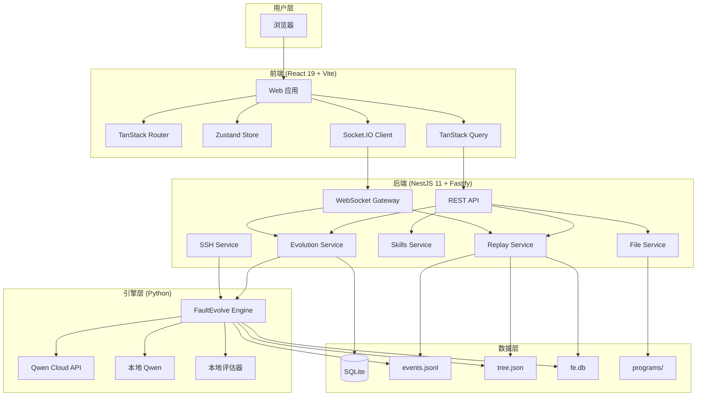

# FaultEvolve-ResearchAssistant 整体架构设计

> 文档版本：v1.1  
> 最后更新：2026-09-28  
> **本版本根据 FaultEvolve 主仓库 main@b59c39e 源码修订**

## 1. 系统定位

FaultEvolve-ResearchAssistant 是一个面向可靠性科研的"AI 科学家"工作台。它将 FaultEvolve 自进化引擎的演化过程可视化，提供实时/回放的演化树浏览、分数曲线、三层知识发现面板、文献依据追溯等功能，同时复用研途启航（Navivisor-webui）的技术栈和部分组件。

## 2. 整体架构图



## 3. 模块划分

### 3.1 前端模块

| 模块 | 职责 | 复用自 Navivisor | 新增/重做 |
|------|------|-----------------|----------|
| 主布局框架 | 侧边栏 + 主内容区 | 复用 `authenticated-layout.tsx` 布局结构 | 调整导航项 |
| 演化树面板 | 实时展示节点、分数、算子、状态 | — | 新增 |
| 分数曲线 | 最佳 ROS 随轮次/时间变化 | — | 新增 |
| 文献依据面板 | 展示知识卡、引用追溯 | 参考 `research-topic` 文献展示组件 | 大幅重做 |
| 反思笔记面板 | 展示三层反思、否证记忆 | — | 新增 |
| 三层知识面板 | 现象/机理/原理卡片 + 数据裁决锦标赛 | — | 新增 |
| Skills 面板 | 通用 Skills 列表与复用情况 | 参考 `skills/` 模块 | 适配新 Skills |
| 实验报告 | 自动生成 Markdown/Word 报告 | 复用 `research-writing` 渲染组件 | 适配新数据格式 |
| 模式指示器 | 显示当前混合云/本地模式 | — | 新增 |
| 科研全流程科普 | 收纳原开题/实验/写作/投稿四模块 | 完整复用四模块代码 | 入口重做 |
| 终端 | SSH 远程执行、引擎日志 | 完整复用 `terminal/` | 适配新用途 |
| UI 组件库 | Button、Dialog、Table 等 | 完整复用 `components/ui/` | — |

### 3.2 后端模块

| 模块 | 职责 | 复用自 Navivisor | 新增/重做 |
|------|------|-----------------|----------|
| Evolution Service | 管理演化运行、状态、事件 | — | 新增 |
| Replay Service | 回放 events.jsonl、tree.json、fe.db | — | 新增 |
| Skills Service | Skills 注册、执行、状态管理 | 复用 `skills/` 模块结构 | 适配新 Skills |
| SSH Service | SSH 远程执行引擎 | 完整复用 `src/terminal/` | — |
| File Service | 文件浏览、程序代码展示 | 复用 `files/` 模块 | 适配 programs/ |
| WebSocket Gateway | 实时事件推送 | 复用 Socket.IO 基础设施 | 新增事件类型 |
| Database | SQLite + Drizzle ORM | 复用 `database/` 模块 | 新增表结构 |
| Auth | 认证（可选） | 复用 `auth/` 模块 | — |

### 3.3 引擎接入方式

有三种方式将 Python FaultEvolve 引擎接入 Node.js 后端：

| 方式 | 描述 | 优点 | 缺点 | 推荐场景 |
|------|------|------|------|---------|
| **Sidecar HTTP 服务** | 引擎独立启动，通过 HTTP/WebSocket 通信 | 解耦、可独立扩展、便于调试 | 需维护两个进程 | **推荐：混合云模式** |
| 子进程 | 后端通过 spawn 启动引擎 | 单一部署包 | 进程管理复杂、日志混合 | 简单部署场景 |
| **SSH 远程执行** | 引擎在用户服务器运行，通过 SSH 控制 | 数据完全本地、算力弹性 | 网络延迟、配置复杂 | **推荐：完全本地模式** |

**推荐架构**：

- **回放模式**：后端直接读取 `events.jsonl`、`tree.json`、`fe.db`，无需引擎
- **实时模式（混合云）**：引擎作为 Sidecar 服务，通过 HTTP API 控制，引擎写事件文件后通过 WebSocket 推送
- **实时模式（完全本地）**：通过 SSH 在用户服务器启动引擎，tail 日志并推送

## 4. 从参考仓库复用的内容

### 4.1 从 Navivisor-webui 复用

| 层级 | 复用内容 | 路径/文件 |
|------|---------|----------|
| **前端技术栈** | React 19 + TS + Vite + Tailwind + TanStack + Zustand + Radix | `web/` |
| **UI 组件** | 全套 Radix UI 封装组件 | `web/src/components/ui/` |
| **布局框架** | 侧边栏 + 主内容区布局 | `web/src/routes/authenticated-layout.tsx` |
| **Socket.IO 客户端** | 实时通信基础设施 | `web/src/socket.ts` |
| **API 客户端** | OpenAPI 类型生成 | `web/src/generated/`、`web/src/api-client.ts` |
| **四模块代码** | 开题/实验/写作/投稿完整实现 | `web/src/components/research-*` |
| **终端组件** | xterm.js 终端 | `web/src/components/terminal/` |
| **后端框架** | NestJS 11 + Fastify | `src/` |
| **Socket.IO 服务端** | WebSocket 网关 | `src/` 中的 `@nestjs/websockets` 使用 |
| **SSH 服务** | SSH2 + node-pty | `src/terminal/` |
| **数据库** | SQLite + Drizzle ORM | `src/database/`、`drizzle/` |
| **Skills 契约** | SKILL.md 规范 | `research-skills/`、`research-tools/contract.md` |

### 4.2 从 FaultEvolve 主仓库复用（已核实 main@b59c39e）

| 内容 | 描述 | 来源文件 | 状态 |
|------|------|---------|------|
| 演化引擎 | UCT + 渐进加宽 + 子树 max 回传 | `engine.py` | ✅ 已实现 |
| Qwen 生成与反思 | DashScope 兼容模式 | `config.py` lines 79-86 | ✅ 已实现 |
| 三层反思 | implementation / design / hypothesis | `schemas.py` | ✅ 已实现 |
| 修复算子 | repair 算子 + 分支记忆 | `engine.py` | ✅ 已实现（有缺陷） |
| 存储层 | fe.db (5 表 + WAL)、tree.json、events.jsonl | `store.py` | ✅ 已实现 |
| ROS 评估器 | `100*(0.5*F1_p10 + 0.3*AUPRC + 0.2*R@FAR)*time_factor` | `evaluator.py` lines 15-24 | ✅ 已实现 |
| CLI | `fe evolve local <task_dir> [--mock] [-n N] ...` | `cli.py` lines 298-366 | ✅ 已实现 |
| 知识卡注入 | 51 张卡，inject 算子，卡片追踪表 | PR #3 (head 673084d) | 🚧 待合入 |
| 发现流水线 | 论断翻译、对手机制、数据裁判锦标赛 | — | 📋 规划中 |

### 4.3 已知缺陷（主线待修复）

| 缺陷 | 位置 | 影响 | 优先级 |
|------|------|------|--------|
| `repair_count` NameError | `engine.py` lines 450, 459 | `_attempt_repair` 方法引用未定义变量 `repair_count`，修复路径会抛 NameError | **高（长跑前必须修复）** |

```python
# engine.py:450, 459 片段（问题代码）
# 引用了未定义的 repair_count 变量
if repair_count >= max_repairs:  # ← NameError: repair_count is not defined
    ...
```

## 5. 新增内容

### 5.1 前端新增

| 功能 | 说明 |
|------|------|
| 演化树可视化 | D3.js 或 React Flow 实现的树形图，支持缩放、拖拽、节点点击详情 |
| 分数曲线 | Recharts 折线图，显示最佳 ROS 和各指标随时间变化 |
| 三层知识卡片 | 现象卡（特征、效应量、CI）、机制卡（因果图、对手、Elo）、理论卡（预测、命中） |
| 数据裁决锦标赛 | 可视化对阵图、检验结果、e 值、Elo 变化 |
| 代码 Diff 面板 | Monaco Editor 展示节点代码与父节点的差异 |
| 模式切换器 | 混合云 / 完全本地模式选择，显示数据流向 |
| Skills 复用展示 | 展示同一 Skill 在 HDD 和内存数据上的应用 |

### 5.2 后端新增

| 服务 | 说明 |
|------|------|
| EvolutionService | 管理演化运行生命周期，与引擎通信 |
| ReplayService | 解析 events.jsonl/tree.json/fe.db，提供回放数据 |
| EvolutionGateway | WebSocket 网关，推送实时事件 |
| KnowledgeService | 管理知识卡、追溯血统 |
| TournamentService | 锦标赛数据处理、Elo 计算 |

### 5.3 去除内容

| 从 Navivisor 去除 | 原因 |
|------------------|------|
| Codex 对话相关 | 不需要通用 AI 对话功能 |
| OnlyOffice 集成 | 不需要在线文档编辑 |
| 外部文献检索（OpenAlex 等） | 知识卡已预构建 |

## 6. 两种部署模式架构

### 6.1 混合云模式

```
┌─────────────────────────────────────────────────────────────┐
│                         云端                                 │
│  ┌─────────────────────────────────────────────────────────┐│
│  │ Qwen API (DashScope)                                    ││
│  │ - qwen3-coder-plus (代码生成)                            ││
│  │ - qwen3-max (反思推理)                                   ││
│  └─────────────────────────────────────────────────────────┘│
│  ┌─────────────────────────────────────────────────────────┐│
│  │ Jev API (TypeSafe AI)                                   ││
│  │ - 候选预筛、判别性检查 (可选)                              ││
│  └─────────────────────────────────────────────────────────┘│
└─────────────────────────────────────────────────────────────┘
                              ↑ 只传代码/论断/聚合量
                              ↓ 不传原始数据
┌─────────────────────────────────────────────────────────────┐
│                       本地/用户服务器                         │
│  ┌────────────┐  ┌─────────────────┐  ┌────────────────────┐│
│  │ Web 前端   │←→│ Node.js 后端    │←→│ FaultEvolve 引擎   ││
│  │ (浏览器)   │  │ (API + WS)      │  │ (Sidecar/子进程)   ││
│  └────────────┘  └─────────────────┘  └────────────────────┘│
│                          ↓                    ↓              │
│                    ┌─────────────────────────────────────┐  │
│                    │ 本地数据存储                         │  │
│                    │ - fe.db, events.jsonl, tree.json    │  │
│                    │ - Backblaze parquet (直接读取)       │  │
│                    │ - 确认切片、远期留出                  │  │
│                    └─────────────────────────────────────┘  │
└─────────────────────────────────────────────────────────────┘
```

### 6.2 完全本地模式

```
┌─────────────────────────────────────────────────────────────┐
│                       完全隔离环境                           │
│  ┌────────────┐  ┌─────────────────┐  ┌────────────────────┐│
│  │ Web 前端   │←→│ Node.js 后端    │  │ FaultEvolve 引擎   ││
│  │ (浏览器)   │  │ (API + WS)      │  │ (远程服务器)       ││
│  └────────────┘  └────────┬────────┘  └────────────────────┘│
│                           │ SSH                ↑             │
│                           └───────────────────→│             │
│                                                              │
│  ┌─────────────────────────────────────────────────────────┐│
│  │ 本地 Qwen (vLLM / Ollama)                               ││
│  │ - Qwen3-Coder-30B-A3B-Instruct (代码生成)               ││
│  │ - Qwen3 通用模型 (反思)                                  ││
│  │ - 本地校准判别器 (替代 Jev)                              ││
│  └─────────────────────────────────────────────────────────┘│
│                                                              │
│  ┌─────────────────────────────────────────────────────────┐│
│  │ 本地数据存储（物理隔离）                                  ││
│  └─────────────────────────────────────────────────────────┘│
└─────────────────────────────────────────────────────────────┘
```

## 7. 数据流

### 7.1 输出文件写入时机（关键）

| 输出 | 写入时机 | 实时可读 |
|------|---------|---------|
| `fe.db` | **运行中增量写入**（WAL 模式） | ✅ 是 |
| `run_summary.json` | 运行结束后一次性写出 | ❌ 否 |
| `tree.json` | 运行结束后一次性写出 | ❌ 否 |
| `events.jsonl` | 运行结束后一次性写出 | ❌ 否 |
| `programs/*.py` | 运行结束后一次性写出 | ❌ 否 |
| `logs/*.log` | 运行结束后一次性写出 | ❌ 否 |

### 7.2 回放模式数据流

```
run_summary.json ──┐
events.jsonl ──────┼──→ ReplayService ──→ REST API ──→ 前端渲染
tree.json ─────────┤                           ↓
fe.db ─────────────┘                     演化树、分数曲线、
programs/*.py ─────────────────────────→ 节点详情、代码 Diff
```

### 7.3 实时模式数据流（fe.db 轮询）

> **重要**：由于 `events.jsonl` 等文件只在运行结束后写出，实时监控必须轮询 `fe.db`。

```
用户启动 ──→ 后端创建任务 ──→ 引擎开始演化
                              ↓
                         写入 fe.db（WAL 模式，增量）
                         ├── event 表：事件流
                         ├── node 表：节点数据
                         └── insight 表：洞见
                              ↓
                         后端轮询 fe.db（500ms 间隔）
                         SELECT * FROM event WHERE id > last_id
                              ↓
                         WebSocket 推送前端
                              ↓
                         前端实时更新

运行结束 ──→ 引擎写出 tree.json, events.jsonl, run_summary.json
                              ↓
                         后端切换到回放模式
```

## 8. 技术选型总结

| 层级 | 技术 | 说明 |
|------|------|------|
| 前端框架 | React 19 + TypeScript | 复用 Navivisor |
| 构建工具 | Vite | 复用 Navivisor |
| 路由 | TanStack Router | 复用 Navivisor |
| 状态管理 | Zustand | 复用 Navivisor，新增 evolution store |
| 数据请求 | TanStack Query | 复用 Navivisor |
| 样式 | Tailwind CSS | 复用 Navivisor |
| UI 组件 | Radix UI | 复用 Navivisor |
| 图表 | Recharts + D3.js | 新增 |
| 代码编辑器 | Monaco Editor | 新增 |
| 后端框架 | NestJS 11 + Fastify | 复用 Navivisor |
| 实时通信 | Socket.IO | 复用 Navivisor |
| SSH | SSH2 + node-pty | 复用 Navivisor |
| 数据库 | SQLite + Drizzle | 复用 Navivisor，扩展 schema |
| 引擎 | Python FaultEvolve | 独立进程/SSH |

## 9. 已核实与待核内容

### 9.1 已核实（main@b59c39e）

| 内容 | 来源 | 状态 |
|------|------|------|
| events.jsonl 行格式 | `schemas.py` Event 模型 | ✅ |
| 11 种事件类型 | SCHEMA_NOTES §1 | ✅ |
| tree.json 9 字段 + edges | `tree.py` Tree.to_export() | ✅ |
| fe.db 5 表 + WAL 模式 | `store.py` | ✅ |
| run_summary.json 格式 | `schemas.py` RunSummary | ✅ |
| ROS 评分公式 | `evaluator.py` lines 15-24 | ✅ |
| CLI 参数 | `cli.py` evolve_local | ✅ |
| LLMConfig | `config.py` lines 79-86 | ✅ |
| 写入时机 | SCHEMA_NOTES | ✅ |
| repair_count 缺陷 | `engine.py` lines 450, 459 | ✅ 确认存在 |

### 9.2 PR #3 扩展（head 673084d，待合入）

| 内容 | 状态 |
|------|------|
| card_stats / branch_refuted_cards / node_adopted_cards 表 | ✅ 已核实 |
| 事件 payload 新增 adopted_cards / refuted_cards | ✅ 已核实 |

### 9.3 仍待核

| 内容 | 原因 |
|------|------|
| 三层知识（现象/机理/原理）完整数据格式 | 主仓库尚未实现发现流水线 |
| 数据裁决锦标赛输出格式 | 同上 |

## 10. SCHEMA_NOTES §10 主线改进建议

> 来自 FaultEvolve SCHEMA_NOTES.md 第 10 节，建议主仓库实施：

1. **修复 `repair_count` NameError**（优先级：高）
   - 位置：`engine.py` lines 450, 459
   - 问题：引用未定义变量
   - 影响：修复路径抛异常，长跑无法正常运行

2. **事件 ID 去重**（优先级：中）
   - 当前 event 表 `id` 为自增整数
   - 建议增加复合唯一索引 `(experiment_id, type, ts)` 防止重复

3. **节点 program 字段压缩**（优先级：低）
   - 长程序占用大量存储
   - 建议支持 gzip 压缩或外部文件引用

4. **HTTP API Sidecar 模式**（优先级：中）
   - 当前只有 CLI 入口
   - 增加可选 HTTP API 便于前端实时控制

5. **tree.json 增加 adopted_cards 字段**（优先级：中）
   - 当前 tree.json 节点不包含知识卡引用
   - 建议从 node_adopted_cards 表导出
