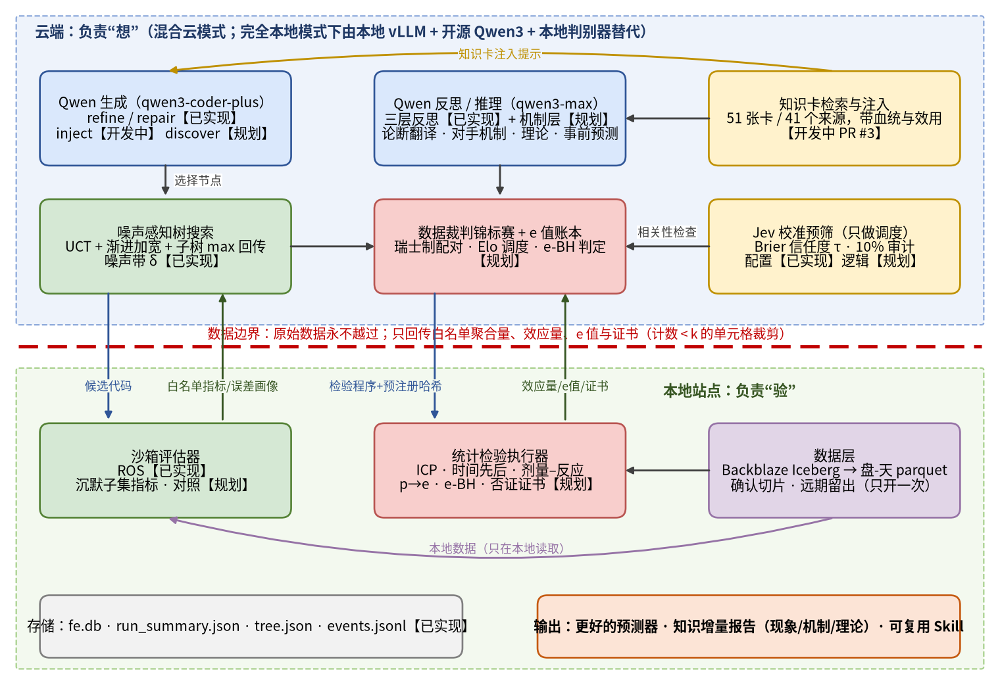

# 0. 封面信息

| 项目 | 内容 |
|---|---|
| 项目名称 | FaultEvolve：可证伪的故障知识自演化系统 |
| 黑客松主题 | 基于 Qwen 大模型的科研提效、认知增强与研发范式革新 |
| 赛题 | A 题「基于大模型 Agent 的器件故障预测算法及自动化调优」 |
| 队伍 / 队长 / 队员 | （待填写） |
| 代码仓库 | github.com/houchenfeng/Self-evolution-optimization-agnet |
| 使用的大模型 | 通义千问 Qwen：云端 qwen3-coder-plus（代码生成）、qwen3-max（反思与推理），经 DashScope 兼容接口调用；完全本地模式使用开源 Qwen3 系列 |
| 文档版本 | v1.1，2026-09-28 修订（v1 同日撰写）；答辩日期 2026-10-06 |
| v1.1 修订要点 | 用 Backblaze Drive Stats 公开 Iceberg 表上的 DuckDB 查询结果回填 §5.1 等处的数据事实（查询脚本与日志：`bb_iceberg/`）；远期留出扩展到 2025Q2–2026Q2；SSD 故障记录不足，跨设备泛化改以内存数据（SmartMem）为主，HDD→SSD 降为探索性参考 |
| 标注约定 | 【已实现】已合并到仓库主分支；【开发中】有未合并的 PR 或正在写；【规划】只有设计；【待核】数据或事实尚未核实。文中没有编造任何实验结果，所有“目标”都只是目标 |

**一句话三件套**

- **使用场景**：数据中心和硬件厂商的可靠性工程师，需要在不能出域的设备日志（硬盘 SMART、内存 CE/UE 日志等）上持续改进故障预测模型，并弄清楚“为什么会坏”。
- **痛点**：大量故障没有明显的 SMART 前兆，靠调参已经到顶；现有 AI 自演化工具在稀有故障上把噪声当成进步，只交付代码和分数，不交付经得起检验的知识；而评估既昂贵又不能把数据交给云端。
- **解决方案**：用 Qwen 负责“提出”（特征代码、论断、对手机制、检验方案），用本地数据和预注册的统计检验负责“裁判”，在噪声感知的树搜索里同时优化预测分和证据强度，最终交付更好的预测器、一份分层的知识增量报告，以及可迁移到新设备的 Skill。

**一句话定位**：FaultEvolve 是面向可靠性科研的“AI 科学家”。它站在 AI co-scientist、POPPER、AutoDiscovery、ERA 和伐谋 FM Agent 等工作的基础上，把“LLM 当裁判”换成“数据当裁判”，并坚持云端只负责“想”、本地负责“验”。

# 1. 背景与痛点

## 痛点一：SMART 看不见大量坏盘，调参已经到顶，缺的是新知识

- Google 对大规模盘群的研究（Pinheiro 等，FAST'07）发现：**超过 56% 的故障盘在 4 个强 SMART 信号上计数为 0**；即使用上全部 SMART 参数，**仍有超过 36% 的故障盘计数为 0**。作者据此认为，仅靠 SMART 不太可能准确预测单盘故障。我们把这类故障称为“沉默故障”。
- **我们在 Backblaze 最新数据上核对过**：2024Q3–2026Q2 的 9,316 次 HDD 故障中，有 1,973 次（21.2%）在故障当天 SMART 5 / 187 / 197 / 198 的原始值全为 0 或未上报；看故障前 30 天窗口仍有 20.1%；各季度在 14.4%（2025Q1）到 32.0%（2025Q3）之间波动。也就是说，经典 SMART 属性**大约漏掉五分之一的故障**，这正是需要发现新特征和新机制的地方。口径说明：这一统计无法区分“属性未上报”和“真实为 0”。
- 同一研究还发现一些反直觉的现象，比如温度与故障率的相关性很弱，甚至低温对应更高的故障率。这类现象是否只是型号或机位造成的混杂，至今没有定论，正是“需要机理解释”的典型例子。
- Schroeder 与 Gibson（FAST'07）报告：数据手册标称的年故障率不高于 0.88%，而现场年更换率通常在 2%–4%，个别系统高达 13%。两篇同年的经典研究在“是否存在婴儿死亡期”上也有分歧。
- 结论：在我们的硬盘基准上，手工 LightGBM 加 14 天趋势特征已经达到验证 ROS 33.70。继续调模型的边际收益有限，**真正的瓶颈是缺少关于故障前兆和故障机理的新知识**。

## 痛点二：AI 自演化工具把噪声当进步，只交付分数，不交付知识

- **稀有正样本让分数天然有噪声。**我们的基准训练集只有 1104 个正样本，对应 29,989 个负样本（负样本按约 10 倍加权）；验证集和测试集的正样本分别是 756 和 770 个。F1 在这种规模下的 bootstrap 波动很大（评估器会输出 f1_boot_std），“涨 0.5 分”常常只是噪声。主流演化系统（例如伐谋的精英池、多数 MCTS/AIDE 类系统）按点估计选优，在这种数据上会系统性地追逐噪声。这是我们的分析，不是这些系统的自述。
- **排行榜分数和复现分数可以相差一倍以上。**WWW 2025 SmartMem 内存故障预测竞赛公布的获奖表里，第二名的 Codabench 第二阶段 F1 为 0.618，主办方复现为 0.301；第三名分别为 0.615 和 0.285。差异的原因可能包括公开榜过拟合、环境不一致等，但它说明，“单次分数”不能当作结论。
- **结论不可追溯，容易幻觉。**MARS 在自己的审计中报告约 88.34% 的教训因果正确，也就是仍有约 12% 不正确，作者承认教训可能是幻觉；SAGE 专门加入 sanitizer 防止编造数字。
- **只有代码和分数，没有知识。**现有系统通常不输出“哪条假设被证实、哪条被否证、效应量多大、能否迁移”。伐谋 FM Agent 在 AmEx 特征挖掘案例中，53 轮把指标从 0.7951 提升到 0.7981，找到了一批有用的特征族，但没有进一步给出可以陈述、可以检验的科学论断。

## 痛点三：评估昂贵、数据私有，AI 却在盲目试错

- **成本高。**DeepScientist 报告使用了约 20,000 GPU 小时；Arbor 每次运行消耗 20–43 M token；MARS 24 小时运行的花费约为 60.5 美元。
- **数据不能出域。**机房的 SMART 数据、服务器内存日志都属于敏感运维数据。以 SmartMem 为例，数据条款限定为非商业用途，并禁止向未签署规则的第三方传播；这类数据天然不适合整体上传到云端。
- **现有混合方案只回传一个分数。**伐谋已经提供“云端生成 + 本地 Evaluator Worker 评估、数据不出域”的混合模式（仅企业版，`--max-concurrent` 默认为 1）。但本地回传的是分数，云端无法据此做“哪个子群漏报、为什么”的推理，也无法控制“评哪个候选最值得”。

# 2. 解决方案总览

**用户做什么（三步）**

1. **准备任务目录**：数据放在本地；提供评估器（`evaluator.py`）、初始解（`init.py`）、问题描述和提示词（`problem.md`、`prompt.md`），可选提供领域知识卡。硬盘任务已经有现成的基准目录 `benchmark/hdd_mvp/`。
2. **一句话启动**：通过 Skill 或命令行（`fe evolve local <task_dir>`）启动。可以选择混合云模式或完全本地模式，设定评估预算和目标分。
3. **审阅与决策**：阅读知识增量报告，对标为“发现候选”的论断做专家复核；必要时写入新的知识卡，进入下一轮。

**系统输出什么（三件交付物）**

| 交付物 | 内容 | 状态 |
|---|---|---|
| ① 更好的预测器 | 演化出的最优程序（特征代码 + 模型），附验证分、私有测试分、验证与测试的差值、token 与算力成本 | 演化循环【已实现】；真实 Qwen 长跑结果【待跑】 |
| ② 知识增量报告 | 分三栏：**现象卡**（新的预测因子，附效应量、置信区间、新颖性证据）、**机制卡**（主机制与对手机制、每场判别检验的 e 值、否证证书）、**理论卡**（事前登记的预测及其在未见数据上的检验结果）。每一条都能追溯到节点代码、评估日志和文献 DOI；被否证的假设作为“负知识”保留 | 【规划】，MVP 计划 10/5 前完成 |
| ③ 可复用 Skill | 从运行中提炼出的 SKILL.md 规范，如故障预测自动调优、知识发现与证伪、沉默故障体检等，可以直接用于新设备或新数据集 | 已有 2 个基础 Skill（见 §6）；其余【规划】 |

# 3. 技术框架

## 3.1 总体架构



文字版（与图对应）：

- **云端（负责“想”）**：Qwen 生成（qwen3-coder-plus：refine / repair / inject / discover）→ 噪声感知树搜索（UCT + 渐进加宽 + 子树 max 回传 + 噪声带 δ）；Qwen 反思 / 推理（qwen3-max：三层反思 + 机制层、论断翻译、对手机制、理论抽象、事前预测）→ 数据裁判锦标赛 + e 值账本；知识卡检索与注入、Jev 校准预筛为二者提供先验和调度。
- **数据边界**：原始数据永不越过；云端下发候选代码、检验程序和预注册哈希；本地回传白名单指标、聚合误差画像、效应量、e 值和否证证书，计数小于 k 的单元格先裁剪。
- **本地站点（负责“验”）**：沙箱评估器（ROS、沉默子集指标、对照）、统计检验执行器（ICP、时间先后、剂量–反应、p→e、e-BH、否证证书）、数据层（本地直接读取公开 Backblaze Iceberg 表 → 落成盘-天 parquet；确认切片与远期留出只开一次）；存储为 fe.db 与运行工件。
- **完全本地模式**：云端部分整体换成本地 vLLM 部署的开源 Qwen3 模型加本地校准小判别器，物理隔离。

**一次迭代的数据流**：选择节点 → Qwen 生成候选代码（带知识卡、分支记忆和否证记录）→ 静态检查 → 本地沙箱评估 → 失败则进入修复算子 → 成功则按 Δ 与噪声带 δ 的关系路由到三层反思 → 提取洞察或写入否证记忆 → 更新树。发现流水线在此之上运行：Top-K 程序 → 论断 → 对手机制 → 判别检验 → 数据裁判锦标赛 → 理论与事前预测 → 报告。

## 3.2 模块说明与实现状态

| # | 模块 | 做什么 | 状态 |
|---|---|---|---|
| M1 | Qwen 生成与反思 | 通过 DashScope 兼容接口调用 qwen3-coder-plus 生成代码、qwen3-max 做反思；支持 MockLLM 离线测试；token 与延迟全部计量 | 【已实现】 |
| M2 | 噪声感知树搜索 | UCT 选择 + 渐进加宽 K = ⌈C·N^α⌉（C = 2.0，α = 0.5）；子树 max 回传；噪声带 δ = κ·σ（σ 取评估器的 bootstrap 标准差，下限 0.5）；只有超过 δ 的提升才算进步 | 【已实现】 |
| M3 | Jev 校准预筛 | 用快速判别器给候选打出校准过的“提升概率”，决定先评哪个；用 Brier 分数自动调整信任度，推迟的候选抽 10% 审计；**只参与调度，不进入报告分** | 配置与中继【已实现】；预筛逻辑【规划】（`prescreen` 目前返回默认值） |
| M4 | 知识卡注入与可追溯 | 51 张知识卡、41 个来源；多因子检索（优先级、标签匹配、贝叶斯均值增量、探索奖励、类别多样性）；记录每个节点采纳了哪些卡 | 知识包【已建好】；注入模块【开发中】（PR #3 未合并） |
| M5 | 失败修复 + 分支记忆 | 运行时错误按“异常类型 @ 库”分类，最多 2 次修复；重复错误写入分支记忆以避免重犯；被否证的假设写入分支记忆并进入后续提示 | 【已实现】（修复路径中有一处已知缺陷，见 §10） |
| M6 | 三层发现（现象 / 机理 / 原理） | 特征 → 论断 → 检验流水线；对手机制；理论卡与事前预测 | 【规划】（方案已定，见 §3.5） |
| M7 | 数据裁判锦标赛 | 对手机制两两比赛，每场由一次预先登记的判别检验决定胜负，Elo 用于调度 | 【规划】 |
| M8 | e 值序贯证伪 | p 值转 e 值，累乘，E ≥ 1/α 时判定；多机制之间用 e-BH 控制 FDR | 【规划】 |
| M9 | 评估器与对照 | ROS 评估器；沉默子集指标；打乱标签、噪声探针、植入信号、植入机制等对照 | ROS 评估器【已实现】；子集指标与对照【规划】 |
| M10 | 存储与输出 | SQLite `fe.db`（节点、事件、LLM 调用）；`run_summary.json`、`tree.json`、`events.jsonl`、每个节点的程序文件 | 【已实现】；知识报告渲染【规划】 |
| M11 | Skill 入口 | `fe-evolve-manager`（运行、恢复、监控）；`fe-knowledge-injection`（知识卡构建与注入） | 前者【已实现】；后者【开发中】（PR #3） |

## 3.3 Qwen 生成与三层反思（M1、M5）

- **算子**：`refine`（在父程序基础上改进）【已实现】；`repair`（失败代码 + 错误尾部 + 父代码 → 修复）【已实现】；`inject`（按知识卡改进，输出 `<adopted_cards>` 标明采纳了哪些卡）【开发中】；`discover`（只允许修改 `make_features` 这个 EVOLVE 块，同时输出论断草稿）【规划】。
- **三层反思**【已实现】：
  - 实现层：纯规则（语法、静态检查、超时），不调用 LLM，节省 token；
  - 设计层：|Δ| 超过 δ 时调用 qwen3-max 分析原因；
  - 假设层：Δ < −2δ，或同一假设连续失败时，把假设标为“已否证”并写入分支记忆；
  - 正向提升超过 δ 时提取洞察，附 z = Δ/σ，沿父链传播，每个节点保留 |z| 最大的 5 条。
- **机制层（第 4 层）**【规划】：当某条论断通过搜索集检验，或同一机制下的两条论断在确认切片上失败时触发，输出结构化因果图和对手机制，交给本地检验执行器。

## 3.4 噪声感知树搜索与 Jev 预筛（M2、M3）

- 树价值只统计超过噪声带的提升：Q = (子树最大分 − 父节点分 − δ)₊ / (目标分 − 初始分)。报告分与选择分分离。
- 发现模式下的价值函数【规划，λ 为预注册参数】：
  V = ROS 提升（超过 δ 的部分）+ λ1·log E（机制累计 e 值，只在确认切片上计算）+ λ2·贝叶斯惊奇（只计方向翻转）+ λ3·通过不变性检验的环境数。报告时仍然只用真实 ROS 和预注册检验的结果。
- Jev（TypeSafe AI 于 2026-09-15 发布，厂商自报延迟 70–500 ms、输出结构化答案并附校准概率）用于：候选预筛、判别检验的相关性检查、知识卡与论断的蕴含判断。信任度 τ = clip(1 − Brier_jev / Brier_base)，Jev 在当前任务上校准差时自动退化为 UCT。厂商宣称的“不会幻觉”指结构类型安全，不等于判断正确，所以我们用 Brier 和随机审计约束它。

## 3.5 三层发现：现象 → 机理 → 原理（M6）

| 层级 | 什么算数 | 内在逻辑 | 验证方式 | 产出 |
|---|---|---|---|---|
| **现象层** | 一个可以写成代码的预测因子 X，加上一条论断 ⟨条件、X、结果、方向与量级（附 CI）、适用范围、否证条件⟩ | **稳定**：换切分、换时间、校正多重比较后仍然成立，而且知识卡推不出它 | 按盘 bootstrap 的效应量 CI；远期时间留出方向一致；BH / e-BH 控制 FDR；打乱标签阴性对照；植入信号阳性对照；相对 51 张卡的语义与功能新颖性 | 现象卡；等级为确认 / 修正 / 发现 / 已否证 |
| **机理层** | 一张因果图，**至少配一个对手机制**，其中至少一个是非因果解释（混杂、厂商计数口径、运维更换造成的删失） | **不变 + 判别**：条件关系跨环境不变（ICP）；在对手预测不同的地方，它通过而对手失败（Platt 强推断） | 跨数据中心 / vault / 型号 / 季度的不变性；时间先后；剂量–反应；条件异质性；聚集；每项检验转成 e 值累计 | 机制卡 + 否证证书；上限是“观测佐证”，达不到干预级因果 |
| **原理层** | 少数概念 + 一条定律 + 适用范围 + **至少一条事先登记的新预测** | **统一 + 新预测**：用更少的概念解释多个机制，并在看数据之前说出下一个现象（Lakatos） | 预测写在从未用过的数据上：2025Q2–2026Q2 远期留出、内存（SmartMem）；HDD→SSD 只作探索性参考（SSD 故障记录不足，见 §5.1）；联合描述长度（MDL / BIC）比分别建模更短 | 理论卡 + 预测登记表（哈希 + 时间戳） |

**特征 → 论断 → 检验流水线**：① 搜索产出 Top-K 程序；② `translate_claim` 把特征代码和聚合统计翻译成论断 JSON；③ 新颖性判断（Qwen 盲推 + Jev 逐卡蕴含 + 在 K0 基础特征之上是否仍有增量）；④ 预注册（PREREG v2，sha256 提交）；⑤ 本地在确认切片上执行检验；⑥ 判级并写入报告。

**示例（纯属假想，只演示格式）**：“在强 SMART 计数全为 0 的盘中，某温度日内波动特征在故障前 3 天升高”→ 对手机制：“型号 / 机位混杂”“运维删失”→ 判别检验：分数据中心的不变性、滞后与超前回归 → 结果写入机制卡。是否存在这样的信号，**现在未知**。

## 3.6 数据裁判锦标赛（M7）

我们保留 AI co-scientist 的锦标赛骨架（种群、两两对决、Elo、进化、元评审），把比赛的裁判从 LLM 换成数据：

1. **参赛池**：每个现象簇 = Qwen 生成的机制 + 固定的非因果对手（混杂：型号 / 部署批次；口径：厂商计数定义；删失：Backblaze 在 SMART 187 > 0 时安排更换）+ 兜底类“其他”。
2. **配对**：瑞士制，优先配 Elo 接近、判别检验期望信息增益大的两个机制。
3. **编译**：`derive_tests` 只保留两个机制预测方向相反，或一方预测为零的检验；Jev 做相关性检查，过滤掉判别性不足的检验。
4. **登记**：预测矩阵（机制 × 检验 → 符号）和检验参数做 sha256 哈希后提交。
5. **比赛**：本地执行器只在确认切片上运行；设计智能体只能看到表结构（这是 POPPER 序贯有效性的前提）。
6. **判定与更新**：e 值足够强且方向符合某一方，该方胜；两边都不够强判平局，标“功效不足”并报告最小可检测效应。Elo 的 K 值按证据强度加权；输家交给 `revise_mechanism` 加条件修正，并计一次“补丁”；修正版必须在没用过的数据上重新比赛。
7. **元评审**：汇总否证证书，找出最有判别力的检验类型、最容易打破不变性的环境，作为下一轮生成和理论抽象的种子。

**为什么 Elo 只排序不判定**：同一数据上的检验彼此相关，违背 Elo 的独立性假设。机制“成立”必须同时满足：判别检验上累计 E ≥ 1/α、通过 ICP 不变性检验、在多机制 e-BH 之后仍入选。

**锦标赛自身的检验**（答辩时可以宣称的实验，结果未知，照实报告）：植入机制对照（半合成数据中注入已知路径和伪关系）；LLM 裁判 vs 数据裁判的排名一致性，以远期留出上的预登记检验为“真值”；打乱环境标签对照。

## 3.7 e 值序贯证伪（M8）

- 参照 POPPER：每项检验得到 p 值后，用校准器 e = κ·p^(κ−1) 转成 e 值，累乘 E = ∏eᵢ；E ≥ 1/α 时拒绝，任意时刻停止都有效。
- POPPER 原文在 α = 0.1 时报告：DiscoveryBench 上 I 类错误 0.103 ± 0.020；去掉相关性检查器后升到 0.134 ± 0.021；用 Fisher 合并时失控到 0.311 ± 0.040。这是我们保留“相关性检查”的依据。
- 我们的扩展：从“单个假设对零假设”扩展到**对手机制之间的判别**；多机制批量判定用 e-BH（POPPER 在局限性部分也建议这样做）；每条判定生成**否证证书**：{机制、对手、检验、环境 / 切片、统计量与 CI、e 值、预注册哈希、日期}。

## 3.8 评估器与对照（M9）

- **ROS 评估器**【已实现】：组合 F1 的 bootstrap 第 10 百分位（200 次分层重采样）、AUPRC、误报率不超过 0.2% 时的召回率，再乘时间罚项 min(1, 600 / 运行秒数)（硬上限 900 秒）。静态检查拦截禁用写法；依赖只允许 pandas、numpy、sklearn、lightgbm、scipy。
- **切分**：训练 2024Q3 / 验证 2024Q4 / 私有测试 2025Q1。
- **沉默子集指标**【规划】：S0 = 故障盘中 SMART 5 / 187 / 197 / 198 在窗口内全为 0 或未上报；另设严格版 S0-strict。指标为 S-Recall@FAR0.2% 和 S-AUPRC，只回传聚合值。
- **对照**【规划】：阴性对照（在型号 × 厂商层内打乱标签，期望通过数为 0；3 列噪声探针）；阳性对照（植入 3 档强度的弱信号，画检出功效曲线；关闭知识卡后重新发现已知的增量类 / 首次非零类特征）。

## 3.9 输出物

| 输出 | 形式 | 状态 |
|---|---|---|
| 运行记录 | `fe.db`、`run_summary.json`（含修复统计、达标轮数、token）、`tree.json`、`events.jsonl`、`programs/` | 【已实现】 |
| 知识增量报告 | Markdown / Word；汇总行：送检 N 条｜确认｜修正｜发现｜已否证｜阴性对照假发现数｜植入信号找回数 | 【规划】 |
| 否证证书库、机制账本 | JSON + SQLite 新表（claim / mechanism / test_result / theory / certificate / match） | 【规划】 |
| Skill | SKILL.md + scripts + references | 部分已有（§6） |

# 4. 创新点

我们不宣称“首创”。每一条都说明借鉴了谁、改进了什么、价值在哪里。

## 创新点 1：数据裁判锦标赛——让数据而不是 LLM 决定哪个机制胜出

- **是什么**：对手机制两两比赛，每场胜负由一次预先登记、只在确认切片上执行的判别检验决定；Elo 只用于配对调度，最终判定依据累计 e 值和不变性检验。
- **为什么重要**：多项研究显示 LLM 擅长给出结构和符号，但判断不准效应大小，也不擅长应用规则（Kıcıman 2023；Manning 等 2024；Hypothesis Search；Phenomenal yet Puzzling）。让 LLM 当裁判，等于让“提出者”兼任“裁判”。
- **先例**：AI co-scientist（Google）的“生成 → 两两对决 → Elo → 进化 → 元评审”锦标赛，比赛主要靠 LLM 模拟辩论，真实验证放在事后湿实验。
- **我们的改进**：保留骨架，替换裁判；元评审汇总的是否证证书而不是评审意见；并设计“LLM 裁判 vs 数据裁判”的对照实验，用远期数据检验哪种排名更准。
- **状态**：【规划】，MVP 目标是至少跑 1 轮、覆盖 3 类检验。

## 创新点 2：对手机制 + 跨环境不变性 + e 值证伪——把“可证伪”落到机制层

- **是什么**：每条机制至少配一个非因果对手；判别检验覆盖时间先后、剂量–反应、条件异质性和跨环境不变性；Backblaze 自 2023-07-01 起完整提供的数据中心、集群、vault、pod 等位置字段被用作 ICP 的“环境”（因此位置类不变性检验只用 2023Q3 以后的数据）；证据按 e 值累计，批量判定用 e-BH。
- **为什么重要**：观测数据上的“机制”最容易被混杂和运维规则伪造。例如 Backblaze 在 SMART 187 > 0 时就安排更换，“187 → 故障”的关联有一部分是运维规则造成的删失。
- **先例**：POPPER（Stanford，e 值序贯证伪、相关性检查器）；ICP（Peters 等 2016，机制 = 跨环境不变的条件分布）；Platt 强推断。
- **我们的改进**：POPPER 检验单个假设对零假设，我们检验对手机制之间的判别；把 ICP 作为机制晋升的必要条件；强制加入“运维删失”对手；每次判定输出可以复查的否证证书。
- **状态**：【规划】。机理层结论的上限是“观测佐证”，不宣称干预级因果。

## 创新点 3：噪声感知树搜索 + 否证记忆——“不把噪声当进步，不重复踩坑”

- **是什么**：用 bootstrap 标准差设定噪声带 δ，同时约束树的价值回传、洞察提取和反思路由；被否证的假设和反复出现的错误类型写入分支记忆，进入之后的提示。
- **为什么重要**：稀有故障场景下，点估计选优会追逐噪声；没有负记忆的系统会反复尝试已经失败的方向。
- **先例**：AutoDiscovery（AllenAI，MCTS + 渐进加宽 + 贝叶斯惊奇）；MARS（预算感知 MCTS + 对比式反思记忆）；Arbor（被否证子树剪枝 + held-out 合并闸门）；SAGE（多假设失败归因）。
- **我们的改进**：把评估噪声显式建进搜索的每个环节；AutoDiscovery 的惊奇由 LLM 采样信念得到，我们改为由检验统计量驱动的可信度账本计算，LLM 只提供先验。
- **状态**：噪声带、子树 max 回传、三层反思、否证记忆【已实现】；认识论价值项【规划】。

## 创新点 4：可追溯的知识卡注入 + 校准预筛——把文献当作可被实验检验的先验

- **是什么**：51 张带来源的知识卡（覆盖 9 类：特征工程 15、模型 6、评估 6、陷阱 6、阈值 5、标注 4、不平衡 3、迁移 3、集成 3），按统计效用检索注入；每个节点记录采纳了哪些卡，最优解可以一路追溯到论文 DOI；卡的效用随实测 Δ 更新；Jev 给出校准概率来调度稀缺的本地评估。
- **为什么重要**：伐谋 FM Agent 原文承认结果对专家知识的问题抽象高度敏感；ERA 的核心卖点正是知识注入。但“哪条知识在这份数据上真的有用”通常没有被度量。
- **先例**：ERA（Google，Nature 2026，高引论文与教科书知识注入 + 树搜索）；AlphaResearch（用 Qwen2.5-7B 奖励模型廉价预筛想法）；DeepScientist（LLM 代理估值 + UCB）。
- **我们的改进**：知识带血统和效用统计，失败的卡在分支内被标记为“已驳斥”；预筛器必须经过 Brier 校准和 10% 随机审计，校准差时自动降权，绝不进入报告分。
- **状态**：知识包【已建好】；注入【开发中】（PR #3）；Jev 预筛【规划】。

## 创新点 5：分层知识增量报告 + Skill 沉淀 + 跨设备事前预测

- **是什么**：输出不只是代码和分数，而是现象 / 机制 / 理论三栏的知识增量报告；把一次运行中验证过的流程和知识提炼成 SKILL.md，迁移到内存等新设备；原理层的预测在打开新数据之前登记哈希。
- **为什么重要**：这是“研发范式革新”的落点：知识可以被检验、被积累、被迁移，而不是每个项目从零开始。
- **先例**：伐谋开源了 Skills；Theorizer（AllenAI，用未来文献回测理论）；AI-Newton（先提出概念，再逐步推广到更广的领域）；Kosmos（报告中每条论断都可以追溯）。
- **我们的改进**：理论层预测写在 2025Q2–2026Q2 远期留出和内存数据上，只打开一次（Backblaze SSD 故障记录不足，只作探索性参考）；Skill 由运行日志蒸馏，附适用条件和护栏。
- **状态**：【规划】。

**与伐谋的差异（一句话）**：伐谋把演化做成了好用的云产品；FaultEvolve 让演化像科学家一样做实验——只承认统计上站得住的进步，把文献当作可以被证伪的假设，让数据当裁判，最后交付可追溯、可迁移的知识。

# 5. 数据实用性与泛化性

## 5.1 主战场：Backblaze 硬盘数据（HDD）

| 项目 | 说明 |
|---|---|
| 来源与许可 | Backblaze Drive Stats，2013 年起每日公开每块在役盘的 SMART 快照。使用条件：注明来源、使用者自负责任、不得出售数据本身 |
| 获取方式 | 季度 CSV 压缩包，以及公开只读的 Apache Iceberg 表（`s3://drivestats-iceberg/drivestats`，可用 DuckDB / Trino 查询）。下面的数据事实均来自我们 2026-09-28 用 DuckDB 直接查询该 Iceberg 表的结果（脚本与日志见 `bb_iceberg/`） |
| 表结构（已核） | 日期范围 **2013-04-10 至 2026-06-30**，共 **744,525,690 行**、**197 列**，按月分区。列包括 date、serial_number、model、capacity_bytes、failure、vault_id、pod_id、datacenter、cluster_id、pod_slot_num、is_legacy_format，以及各 SMART 属性的 smart_N_raw / smart_N_normalized |
| 规模（已核） | 2023Q1–2026Q2 每季约 2,100 万–3,200 万盘-天、24.3 万–35.9 万块盘、约 930–1,520 次故障；近 6 个季度的故障数：2025Q1 1,067、2025Q2 1,061、2025Q3 1,254、2025Q4 945、2026Q1 1,030、2026Q2 1,522（逐季完整表：`bb_iceberg/quarterly_2023_2026.csv`）。作为外部参照，Backblaze Q1 2026 报告：季末监控 345,662 块盘，去掉启动盘等之后分析 341,263 块硬盘 |
| 故障盘历史长度（已核） | 全部年份共 33,331 块故障 HDD，从首次出现到故障的跨度中位数 1,032 天（p10 184 天，p90 2,375 天）；其中 3,018 块在表首日 2013-04-10 已在役（左删失）。长轨迹是现成的，而现有基准 hdd_mvp 只用了 14 天窗口 |
| 位置字段（已核） | 2023Q1 全空；2023Q2 只有 vault_id / pod_id；**自 2023-07-01 起** datacenter、cluster_id、vault_id、pod_id 覆盖率 100%，pod_slot_num 约 98.7%。共 6 个数据中心（phx1、sac0、sac2、iad1、ams5、yyz1），每季 6–7 个集群、207–259 个 vault；pod_id 是 vault 内编号（只有 20 个取值），使用时要与 vault_id 组合。**位置 / 环境不变性检验只能用 2023Q3 以后的数据** |
| SSD（已核） | SSD 与 HDD 在同一张表，但**没有设备类型列**，只能按型号正则识别（主要是 250–480 GB 的启动盘）。全部年份 SSD 故障约 235 次；2025 年和 2026 年上半年约 3,400–3,500 块 SSD 在役，但**故障数为 0**，很可能是这段时间 SSD 故障已不再记录。因此 HDD→SSD 的跨设备检验**功效弱、可靠性存疑**，只作探索性参考；跨设备泛化改以内存数据（§5.2）为主 |
| 沉默故障（已核） | 2024Q3–2026Q2 的 HDD 故障中，故障当天 SMART 5 / 187 / 197 / 198 原始值全为 0 或未上报的占 21.2%（1,973 / 9,316）；前 30 天窗口内全为 0 的占 20.1%；各季度 14.4%–32.0%。该口径无法区分“未上报”和“真实为 0” |
| 标签语义 | failure = 1 表示“盘被标记更换”，不等于物理失效；187 > 0 即更换的运维规则会造成删失 |
| 数据缺口 | 没有固件、生产批次、SMR/CMR、工作负载字段；批次效应只能用部署时间或 vault 代理 |
| 查询成本（已核） | 在一台 8 核 / 15 GB 内存的机器上经公网直接查询：季度级聚合约 13 秒，全表扫描约 2 分钟。做法是先把所需列落成本地 parquet 再反复使用。这说明“本地算力直接读取公开数据”是可行的，与“云端想、本地验”的部署方式一致 |

**数据切分（已决定）**

| 集合 | 时间或范围 | 用途 | 谁能看到 |
|---|---|---|---|
| 基准训练 / 验证 | 2024Q3 / 2024Q4 | 现象层的特征演化与选择 | 搜索 |
| 探索长面板 | 2013–2024Q4 的盘-天轨迹，去掉确认盘 | 长窗口特征、机制探索、检验编译 | 搜索与反思 |
| 确认切片 | 同一时期**按序列号留出**的一部分盘；位置类环境只用 2023Q3 以后的数据（此前位置字段为空或不全） | 锦标赛比赛、e 值、ICP | 只有本地执行器；设计智能体只看表结构 |
| 基准私有测试 | 2025Q1 | **只用于报告 ROS，不用于发现** | 本地 |
| 远期留出 | 2025Q2–2026Q2（五个季度，数据已到 2026-06-30） | 现象层时间外推、原理层事前预测；**PREREG v2 提交后只打开一次** | 本地 |
| 跨设备（主） | 内存数据（SmartMem，Codabench 3586，见 §5.2） | HDD→内存的概念层迁移与事前预测 | 本地，只打开一次 |
| 跨设备（探索） | Backblaze SSD（2025 年起无故障记录） | HDD→SSD 探索性检查，不作为主要证据 | 本地 |

说明：Backblaze 是公开数据，“留出”靠预注册哈希和提交时间戳来保证，而不是靠访问控制；Qwen 的预训练里也可能见过 Backblaze 对 2025 年的总结，这一点在风险中说明。

**沉默故障聚焦**：以 FAST'07 的“超过 36% 零计数”作为外部参照；Backblaze 2016 年的博客则报告 76.7% 的故障盘在其 5 个关键属性中至少一个大于 0（即约 23% 全为 0）。我们在 2024Q3–2026Q2 的数据上算得的比例是 21.2%（故障当天，4 个属性）和 20.1%（30 天窗口），与 Backblaze 2016 年的口径量级一致；各切分中 S0 的正样本数和厂商分布仍需在本地计算，只回传聚合数。

## 5.2 第二验证域：内存故障（SmartMem，Codabench 3586）

以下信息来自 Codabench 竞赛页面及其公开 API（2026-09-28 核对）。

| 项目 | 说明 |
|---|---|
| 竞赛 | WWW 2025: SMARTMEM Memory Failure Prediction Competition，由华为云 RAS 团队等组织（联系邮箱为华为域名），2025 年 4 月公布获奖名单；平台显示 244 名参与者、1606 次提交 |
| 任务 | 预测每条 DIMM（按序列号）在未来 k 天内是否发生**不可纠正错误（UE）**，二分类 |
| 数据内容 | `type_A`、`type_B` 两类服务器的内存日志（由 mcelog 采集，23 列），覆盖 2024-01-01 至 2024-07-31；第二阶段新增 2024 年 8–9 月日志。字段包括：CPU / 通道 / DIMM / rank / device / bank group / bank / row / column 的位置信息；retry 读错误日志与奇偶校验；`burst_info`（解码后的 DQ 与 beat 错误位）；`error_type`（读错误、巡检错误等）；时间戳；匿名化的服务器厂商、CPU 型号、DIMM 料号；容量、频率、MCA bank、内存类型（如 DDR4）、匿名区域 |
| 标签 | `failure_ticket.csv`：每条 DIMM 只记录第一次故障时间（2024-01-01 至 2024-05-31），以及服务器类型 A / B |
| 评估 | 提前量 15 分钟、预测窗口 7 天：某个 SN 只要有一个预测时间落在“故障前 15 分钟到 7 天”之间即算命中；按 SN 计算 Precision、Recall 和 **F1**。第一阶段主办方基线 F1 为 0.207 |
| 流式约束 | t 时刻只能用 t 之前的日志；预测时间戳不得早于输入的最新日志；历史预测不得被未来预测改变 |
| 规模与获取 | 第一阶段数据：Feather 格式解压约 40 GB，CSV 约 130 GB；另有 Kaggle 上的处理后特征集（smartmem/smartmem-features）；官方 starter kit 在 GitHub `hwcloud-RAS/SmartHW` |
| 许可 | 竞赛条款：**仅限非商业用途**（参赛、学术研究和教育）；不得向未同意规则的第三方传播数据；另受 CC BY-NC-SA 4.0 约束（条款文字写的是 BY-NC-SA，但链接指向 BY-NC 页面，两者不一致，以条款文字为准需复核）。条款还写明竞赛期间“禁止使用主办方以外的数据”，该限制针对参赛提交；我们赛后做学术研究是否需要再征得同意【待核】 |
| 背景文献 | HiMFP（DSN 2023）、错误位相关性研究（ICCAD 2023）、跨 CPU 架构的内存故障预测（DSN-S 2024）、Li 等 SC22（从 CE 的错误位看 UE） |

**为什么适合做第二验证域**：它与硬盘在“结构”上同构——都是稀有故障、极度不平衡、分布漂移、多厂商异构、需要提前量——但在“信号”上不同：内存有丰富的空间结构（bank / row / column、DQ / beat 错误位），硬盘没有。这正好检验“哪些知识是可迁移的原理，哪些只是设备特有的现象”。而且它是私有性强的运维数据，是混合云“数据不出域”的真实用例。

**诚实声明**：**我们目前没有在 SmartMem 上做过任何实验**，没有下载数据，也没有任何分数。下面的内容全部是计划。

## 5.3 迁移协议（HDD → 内存为主；HDD → SSD 仅作探索）

1. **概念层映射（人工确认）**：只迁移概念，不迁移列名。例如：“累计计数取增量 / 增长率”（SMART 5、197 ↔ CE 次数）；“首次非零后经过的时间”；“按厂商 / 型号分层的阈值”；“误报率约束下选阈值”；位置环境（pod / slot ↔ region / CPU / channel）。映射表写入预注册。
2. **冷启动对比**：迁移组带着硬盘上验证过的知识卡和 Skill 冷启动，空白组不带；同样的评估器、预算和种子，比较达标所需评估次数和最终分。
3. **原理层事前预测**：例如候选原理（**纯属假设**）“风险由屏蔽资源的消耗速率决定，而不是由损伤存量决定”。在 SmartMem 上预测“CE 增长率优于 CE 累计数”；Backblaze SSD 因 2025 年起没有故障记录、历史故障只有约 235 次，只做“消耗速率类 vs 存量类”的探索性检查，不计入事前预测命中率。同时登记一条对手理论（“风险由存量决定”）的相反预测，二者在同一数据上比赛。
4. **只开一次**：远期留出（2025Q2–2026Q2）和 SmartMem 的检验都在 PREREG v2 提交后执行一次，命中与否都如实报告；SSD 探索性检查的结果单独列出。
5. **外部硬盘数据（可选）**：阿里 PAKDD 2020 数据（超过 20 万块盘，514 列，带故障子类型标签），只检验方向一致性；天池页面的数据许可需人工确认。

## 5.4 泛化指标

| 指标 | 定义 |
|---|---|
| 时间外推差 | 验证分与私有测试分之差；远期留出上的方向一致率 |
| 跨环境一致性 | 通过 ICP 不变性检验的环境数；按数据中心、型号、厂商留一的效应方向一致率 |
| 迁移冷启动增益 | (空白组达标评估次数 − 迁移组达标评估次数) / 空白组达标评估次数；以及同预算下的最终分差 |
| 事前预测命中率 | 预注册预测在未见数据上被证实的比例，同时统计补丁数（Lakatos 意义上的“进步 vs 退化”） |
| 负迁移检测 | 迁移组比空白组更差时如实报告，并把对应知识卡在新领域标为“不适用” |

## 5.5 产业价值

- **对运维**：沉默故障一旦找到可靠前兆，就能把“意外宕机”变成“计划更换”；每条结论都带适用范围和否证条件，工程师知道什么时候可以信。
- **对硬件厂商与云厂商**：同一套流水线可以在硬盘、SSD、内存之间复用；数据不出域，适合在机房本地部署。
- **对科研**：把“调参”升级为“产出可检验的知识”，负结果和被否证的机制同样被记录，减少重复试错。

# 6. 通用 Skills 产出

## 6.1 什么是 Skill

Skill 是一份可以被 AI Agent 直接执行的“操作规范”，用 SKILL.md 描述，附带脚本和参考资料。仓库里已经有两份：

- `fe-evolve-manager`【已实现】：环境检查、启动 / 恢复本地演化、修复算子说明、输出文件说明、禁止操作；
- `fe-knowledge-injection`【开发中，PR #3】：知识卡生成脚本与注入说明。

## 6.2 统一格式

```text
---
name: <skill-id>
description: <一句话：什么时候用>
---
## 触发条件      什么任务 / 什么信号下调用
## 输入          必需文件、数据接口、配置项（含预算）
## 步骤          编号步骤，每步写明调用的工具或脚本、成功判据
## 输出          产物清单与格式（JSON / Markdown / 程序文件）
## 护栏          禁止操作（如不得读取留出集、不得回传原始数据、报告分只来自真实评估器）
## 适用范围      在哪些设备 / 数据上验证过；已知失效条件
## 血统          由哪些运行（experiment_id）、哪些知识卡蒸馏而来
```

## 6.3 计划产出的 5 个 Skill

| Skill | 触发 | 输入 | 关键步骤 | 输出 | 护栏 | 状态 |
|---|---|---|---|---|---|---|
| **故障预测自动调优** | 新设备或新数据集需要预测器 | 任务目录（评估器、初始解、问题描述）、预算 | 环境检查 → 基线评估并估计噪声 δ → 噪声感知树搜索 → 修复 → 达标停止 | 最优程序、运行摘要、成本 | 报告分只来自真实评估器；不读留出集 | 基础版【已实现】（fe-evolve-manager） |
| **知识发现与证伪** | 需要解释“为什么”或产出可发表的结论 | Top-K 程序、知识卡、表结构、确认切片接口 | 论断翻译 → 新颖性判断 → 对手机制 → 判别检验编译 → 预注册 → 本地检验 → e-BH 判级 | 现象卡、机制卡、否证证书 | 设计阶段只看表结构；每个切片只用一次；未定不等于否证 | 【规划】 |
| **数据体检 / 沉默故障分析** | 接入新数据时的第一步 | 本地数据 | 字段覆盖率、标签语义、删失规则、沉默子集占比、统计功效估计 | 数据事实表（只含聚合量） | 小单元格裁剪；不输出序列号 | 【规划】（Backblaze 数据事实已于 2026-09-28 查询核实，见 §5.1；Skill 封装待做） |
| **文献知识卡构建** | 新领域冷启动 | 检索关键词、种子文献 | 检索 → 核对来源 → 写卡（论断、依据、适用性、风险、来源 ID、实现提示）→ 校验 | cards.jsonl、sources.yaml、专家文档 | 只收录实际打开过的来源；未核实的标注出来 | 【开发中】（PR #3，硬盘 51 张卡已建） |
| **实验报告生成** | 运行结束 | fe.db、检验清单、预注册哈希 | 从检验清单自动取数 → 渲染三栏报告 → 附对照与成本 | Markdown / Word 报告 | 数字只能从 manifest 读取，禁止手填 | 【规划】 |

## 6.4 如何从运行中蒸馏

1. **收集**：从 `events.jsonl` 和 `fe.db` 中取出反复带来超过 δ 提升的操作序列、被否证的方向、常见错误类型及其修复方式。
2. **抽象**：由 qwen3-max 把具体代码抽象成步骤和判据（例如“先估计噪声 δ，再决定晋级阈值”），并标注血统。
3. **验证**：在另一个种子或另一段时间上回放这份 Skill，只有达到同等或更好效果时才发布；失败的写入“已知失效条件”。
4. **版本化**：Skill 与知识卡一起版本管理，更新时保留旧版的适用范围。

## 6.5 如何迁移到新设备或新领域

- 迁移时只带**概念级内容**（步骤、判据、护栏、概念映射），列名和阈值在新数据上重新学习；
- 新领域第一次使用时先执行“数据体检”Skill，自动检查概念映射的前提（例如内存数据有没有累计计数字段）；
- 迁移效果用 §5.4 的冷启动增益衡量，负迁移会被记录并回写到 Skill 的“适用范围”。

# 7. 隐私与部署

## 7.1 两种模式

**模式 A：混合云（默认）**

- 云端：Qwen API（qwen3-coder-plus 生成、qwen3-max 反思与推理）、Jev 预筛与相关性检查、树搜索与报告渲染。
- 本地：沙箱评估、长面板构建、全部统计检验（ICP、e 值、e-BH）、确认切片与远期留出。公开数据可以由本地直接读取：实测 8 核 / 15 GB 机器经公网查询 Backblaze Iceberg 表，季度聚合约 13 秒、全表扫描约 2 分钟，先落成本地 parquet 再使用。
- 原则：**只有白名单聚合量和代码离开站点，原始数据永不离开。**单元格计数小于 k（例如 10）的统计量先裁剪再回传。

**模式 B：完全本地（物理隔离）**

- 生成与反思：本地用 vLLM 部署开源 Qwen3 系列模型。例如 Qwen3-Coder-30B-A3B-Instruct 负责代码生成（vLLM 官方文档已列出对它的支持），Qwen3 通用模型负责反思。具体型号和量化方案按本地 GPU 条件选择，显存需求以模型卡为准。
- 裁判：用本地校准的小判别器替代 Jev。做法是用树搜索日志中的（候选描述，真实 Δ）样本对一个 Qwen3 小模型做温度缩放或保序校准，并用 Brier 分数与 Jev 对比。**此项纯属规划，效果未知。**
- 适用：军工、金融、运营商等不允许调用外部 API 的机房；Jev 服务部署在美国西海岸（厂商自述），有跨境合规顾虑时也用这一模式。

## 7.2 跨边界数据流

| 内容 | 方向 | 混合云 | 完全本地 | 说明 |
|---|---|---|---|---|
| 原始日志（SMART、内存日志、序列号） | — | **不出站** | 不出站 | 始终留在本地 |
| 表结构（列名、类型） | 本地 → 云 | 允许 | 不涉及 | 设计智能体只看表结构 |
| 候选代码、检验程序 | 云 → 本地 | 允许 | 不涉及 | 本地先静态检查再在沙箱执行 |
| 白名单指标（ROS 分项、f1_boot_std、S-AUPRC 等） | 本地 → 云 | 允许 | 不涉及 | 白名单文件控制 |
| 聚合误差画像（按厂商 / 型号的漏报、误报率） | 本地 → 云 | 允许（k-匿名裁剪） | 不涉及 | 小于 k 的单元格裁剪 |
| 效应量、置信区间、e 值、否证证书 | 本地 → 云 | 允许 | 不涉及 | 全是聚合量 |
| 错误堆栈 | 本地 → 云 | 截断并脱敏后允许 | 不涉及 | 可配置为只在本地反思 |
| 论断、机制、卡片文本 | 云 → Jev | 允许（不含数据） | 由本地判别器替代 | 只用于调度 |
| 预注册哈希 | 双向 | 允许 | 本地保存 | 用于“只开一次”的审计 |

## 7.3 与伐谋混合模式的对比（如实）

| 维度 | 伐谋混合模式（据其公开文档与论文） | FaultEvolve |
|---|---|---|
| 云生成 + 本地评估、数据不出域 | **已有**（仅企业版；`cloud_type: "hybrid"`，本地常驻 Evaluator Worker） | 同样具备——**这不是我们的创新点** |
| 本地回传内容 | 分数（及评估反馈） | 结构化证据：白名单指标、误差画像、效应量、e 值、否证证书 |
| 评哪个候选 | 按生成顺序评估，`--max-concurrent` 默认为 1 | 规划用校准预筛决定先评哪个，并用审计估计漏检率 |
| 统计检验在哪里 | 未见相关说明 | 全部在本地执行，确认切片只有本地执行器能看 |
| 完全离线 | 公开文档中我们未见完全离线模式的说明 | 规划开源 Qwen3 + 本地判别器的物理隔离模式 |
| 产品成熟度 | 产品化程度高、有企业用户、Skills 开源 | 研究原型，演化循环已实现，发现流水线在开发中 |

# 8. 预期成果与评测指标

## 8.1 当前事实（截至 2026-09-28）

| 事实 | 数值 / 状态 | 来源 |
|---|---|---|
| 规则基线 ROS（验证） | 12.94 | 仓库基准 |
| 初始解（逻辑回归）ROS | 验证 22.81 / 测试 25.37 | 仓库基准 |
| 手工 LightGBM + 14 天趋势特征 | 验证 33.70 / 测试 33.58 | 仓库设计文档记录 |
| 仓库内最近一次演化记录 | Mock 运行，最优即初始解 22.81 | 仓库 |
| 真实 Qwen 演化结果 | **仓库中尚无记录** | — |
| 用户提到的早先 10 轮最优 34.96 | **待复核**（不在仓库中，不作为结果引用） | 口述 |
| 已合并功能 | PR #1（本地演化循环）、PR #2（修复算子、可配置存储、Jev 中继配置） | GitHub |
| 进行中 | PR #3（ERA 风格知识注入，未合并） | GitHub |
| 知识包 | 51 张卡、41 个外部来源、专家文档 | /workspace/knowledge |
| Backblaze 数据规模 | 2013-04-10 至 2026-06-30，744,525,690 行、197 列；33,331 块故障 HDD，历史跨度中位数 1,032 天 | DuckDB 查询公开 Iceberg 表（`bb_iceberg/`） |
| 沉默故障占比（HDD，2024Q3–2026Q2） | 故障当天 21.2%（1,973 / 9,316）；30 天窗口 20.1%；季度间 14.4%–32.0% | 同上 |
| 位置字段 | 2023-07-01 起数据中心 / 集群 / vault / pod 100% 覆盖 | 同上 |
| SSD 故障记录 | 全部年份约 235 次；2025 年起为 0 | 同上 |

## 8.2 评测指标与目标（均为目标，不是结果）

| 指标 | 定义 | 目标 / 预期 |
|---|---|---|
| ROS（验证 / 测试） | 评估器组合分 | 真实 50 轮运行验证分 ≥ 32（evolve.yaml 中的目标分），验证与测试差 ≤ 3 |
| 沉默故障召回 S-Recall@FAR0.2% | S0 子集在 0.2% 误报率下的召回 | 高于规则基线（规则基线按定义为 0）；报告点估计与 bootstrap 区间 |
| 达标轮数 / 达标评估次数 | 首次达到目标分所需的迭代数、本地评估数 | 与 top-k 贪心、随机特征搜索在同预算下对比 |
| token 成本 | 生成、反思、修复、知识注入的 token 分项 | 在运行摘要中完整记录；不预估单价 |
| 每 100 次评估的已验证新颖发现数（VND/100） | 判为“修正”或“发现”、且通过 FDR 和对照的论断数 | 诚实预期：在 6–10 次运行、每次 40–50 次评估的规模下很可能是 0 到个位数 |
| 阴性对照假发现数 | 打乱标签后通过检验的论断数 | 期望为 0 |
| 植入信号找回率 | 3 档强度下被找回的比例 | 画检出功效曲线 |
| 迁移冷启动增益 | 见 §5.4 | 内存上的对比【规划】（SSD 只作探索） |
| Jev 校准质量 | Brier、ECE、可节省的评估比例、漏检率 | 先做离线回放【规划】 |

**如果没有达到“发现”级**：如实说明“在预注册检验下，本轮没有达到发现级的论断”，并展示修正 / 否证级结论、否证证书、阳性对照找回了植入信号、阴性对照为 0。我们的主张是：“这是一台经过校准的发现机器——能找回已知规律，不编造不存在的规律，并把失败变成证书。”

# 9. 进度与计划（9/29 – 10/6）

| 日期 | 主要任务 | 当日闸门 |
|---|---|---|
| 9/29 周二 | Backblaze 数据事实表（日期范围、行数、位置字段覆盖率、SSD 情况、查询耗时已于 9/28 查询核实，见 §5.1；整理成表并补 S0 各切分正样本数）；PREREG v1（三层定义、切分、阈值、只开一次规则）；发现任务 harness 与 JSON schema | 数据事实表填完；初始解与 K0 在验证集跑通并记录单次评估耗时；SSD 已确定不进 MVP（故障记录不足），只作探索 |
| 9/30 周三 | 长面板与按盘留出的确认切片；子集指标；对照工具；6 类检验模板 + p→e + e-BH + Elo | Mock 5 轮通过；植入信号 / 植入机制能被找回 |
| 10/1 周四 | 启动 6 次真实 Qwen 运行（卡片开 / 关 × 2 种子 + 打乱标签 + 植入信号）；论断翻译、新颖性、ICP | 至少 4 次运行完成过半 |
| 10/2 周五 | Top-K → 论断 → 对手机制 → 判别检验；锦标赛在探索集上试跑；起草理论卡与事前预测 | 送检论断 ≤ 30 条，每条至少 2 个对手 |
| 10/3 周六 | 提交 PREREG v2 哈希 → 锦标赛只在确认切片上正式比赛 → 判级与证书 → 远期留出只打开一次 | 结果冻结，此后不改论断 |
| 10/4 周日 | HDD→SSD 探索性检查（可选）；消融与 SHAP；对照汇总；VND/100 与成本；可选：LLM 裁判 vs 数据裁判 | 报告初稿 |
| 10/5 周一 | 知识增量报告定稿；一页图；60–90 秒演示脚本；录屏兜底；答辩问答准备 | **MVP 截止 20:00** |
| 10/6 周二 | 答辩 | — |

**MVP**：数据事实表；现象层真实运行与对照；机理层至少 1 轮数据裁判锦标赛（3 类检验）；至少 1 张理论卡和 1 条在远期留出上检验的预注册预测；一份三栏报告。**Stretch**（按优先级）：SmartMem 事前预测（跨设备泛化的主要证据）、LLM 裁判 vs 数据裁判对比、中介分析、机制层并入主线引擎、电池数据阳性对照、Jev 预筛与 Brier 审计、HDD→SSD 探索性检查、阿里数据跨数据集检验。

# 10. 风险与应对

| 风险 | 影响 | 应对 |
|---|---|---|
| 真实 Qwen 长跑尚未完成 | 没有可展示的演化结果 | 10/1 启动 6 次运行；同时准备录屏和离线流程演示，并明确标为“流程演示” |
| 已知代码缺陷：`_attempt_repair` 在修复生成失败和静态检查失败两个分支里引用了未定义的 `repair_count` | 这两条路径会抛 NameError，中断运行 | 列入主线修复清单，长跑前必须修掉 |
| 新颖性只能宣称“对系统新”（P 新颖） | 被质疑“AI 发现了人类早已知道的规律” | 只说“相对 51 张卡与 Qwen 先验是新的”；对外宣称前做文献检索和专家复核 |
| 观测数据只能给出佐证 | 被质疑因果 | 机理层上限写明为“观测佐证”；强制配非因果对手；报告写明 ICP 的前提假设 |
| 标签语义与运维删失 | 伪造“187 → 故障”一类关联 | “运维删失”作为必配对手机制 |
| 公开数据的留出靠纪律；Qwen 可能见过 2025 年总结 | 事前预测的可信度 | 预注册哈希 + 提交时间戳；记录 Qwen 生成预测时引用的依据 |
| 统计功效不足（S0 和部分环境正样本少） | 负结果被误读为否证 | 判为“未定”并报告最小可检测效应 |
| 锦标赛检验相关、LLM 检查器高估相关性（POPPER 报告检查器判 85% 强相关，人工判 77%） | 判定偏乐观 | Elo 只做调度；判定用 e 值 + 不变性；随机人工抽检 |
| SSD / 内存字段与 HDD 不同 | 迁移只能在概念层 | 映射表人工确认并写入预注册；内存实验明确标为“计划” |
| Backblaze SSD 故障记录不足（2025 年起为 0，历史约 235 次） | HDD→SSD 检验功效弱、结论不可靠 | SSD 只作探索性参考；跨设备泛化以 SmartMem 内存数据为主 |
| 位置字段只在 2023Q3 以后完整 | 环境不变性检验的数据量受限 | 位置类 ICP 只用 2023Q3 以后的数据；更早时期用型号、季度、盘龄作环境 |
| 沉默故障口径无法区分“未上报”和“真实为 0” | S0 比例可能被高估或混入厂商口径差异 | 同时报告按厂商 / 型号分层的比例，并设严格版 S0-strict |
| SmartMem 许可与使用范围 | 合规风险 | 仅做非商业学术研究；数据不再分发；使用前确认条款适用于赛后研究 |
| Jev 外部服务与跨境合规 | 不能在敏感站点使用 | 完全本地模式用本地判别器替代 |
| 时间紧，主线改动来不及合并 | 功能缺失 | MVP 设计为不依赖主线改动：发现流水线可以先以离线脚本形式存在，报告中如实说明 |

# 11. 参考文献

**可靠性与数据**

1. Pinheiro, Weber, Barroso. Failure Trends in a Large Disk Drive Population. FAST'07. https://www.usenix.org/conference/fast-07/failure-trends-large-disk-drive-population
2. Schroeder, Gibson. Disk Failures in the Real World. FAST'07. https://www.usenix.org/legacy/events/fast07/tech/schroeder/schroeder_html/index.html
3. Elerath. Hard-disk drives: the good, the bad and the ugly. CACM 52(6), 2009. http://aturing.umcs.maine.edu/~meadow/courses/cos335/elerath-good-bad-ugly2009.pdf
4. Lu et al. Making Disk Failure Predictions SMARTer! FAST'20. https://www.usenix.org/conference/fast20/presentation/lu
5. Meza et al. A Large-Scale Study of Flash Memory Failures in the Field. SIGMETRICS'15. https://dl.acm.org/doi/10.1145/2796314.2745848
6. Backblaze. Hard Drive Test Data（Drive Stats 数据集与 Iceberg 访问说明）. https://www.backblaze.com/cloud-storage/resources/hard-drive-test-data
7. Backblaze. Drive Stats for Q1 2026. https://www.backblaze.com/blog/backblaze-drive-stats-for-q1-2026/
8. Backblaze. Drive Stats for Q3 2023（新增位置字段）. https://www.backblaze.com/blog/backblaze-drive-stats-for-q3-2023/
9. Backblaze. What SMART Stats Tell Us About Hard Drives. https://www.backblaze.com/blog/hard-drive-smart-stats/
10. Backblaze. Iceberg on Backblaze B2. https://www.backblaze.com/blog/iceberg-on-backblaze-b2/
11. WWW 2025 SmartMem Memory Failure Prediction Competition. https://www.codabench.org/competitions/3586/ ；主页 https://hwcloud-ras.github.io/SmartMem.github.io/ ；starter kit https://github.com/hwcloud-RAS/SmartHW ；特征集 https://www.kaggle.com/datasets/smartmem/smartmem-features
12. Yu et al. HiMFP: Hierarchical Intelligent Memory Failure Prediction for Cloud Service Reliability. DSN 2023. https://doi.org/10.1109/DSN58367.2023.00031
13. Yu et al. Exploring Error Bits for Memory Failure Prediction: An In-Depth Correlative Study. ICCAD 2023. https://ieeexplore.ieee.org/abstract/document/10323692
14. Yu et al. Investigating Memory Failure Prediction Across CPU Architectures. DSN-S 2024. https://ieeexplore.ieee.org/document/10647082
15. Alibaba PAKDD 2020 磁盘数据. https://github.com/alibaba-edu/dcbrain/tree/master/diskdata ；https://tianchi.aliyun.com/dataset/dataDetail?dataId=70251

**AI 科学家与自演化系统**

16. FM Agent（百度伐谋）. arXiv:2510.26144. https://arxiv.org/abs/2510.26144 ；混合模式文档 https://cloud.baidu.com/doc/FAMOU/s/cmpa2jbrh ；Skills https://github.com/baidubce/skills
17. AI co-scientist（Google）. arXiv:2502.18864. https://arxiv.org/abs/2502.18864 ；Nature https://www.nature.com/articles/s41586-026-10644-y
18. POPPER: Automated Hypothesis Validation with Agentic Sequential Falsifications. arXiv:2502.09858. https://arxiv.org/abs/2502.09858
19. AutoDiscovery（AllenAI）. arXiv:2507.00310. https://arxiv.org/abs/2507.00310
20. ERA: Empirical Research Assistance（Google）. Nature. https://www.nature.com/articles/s41586-026-10658-6 ；arXiv:2509.06503
21. MARS. arXiv:2602.02660. https://arxiv.org/abs/2602.02660
22. Arbor. arXiv:2606.11926. https://arxiv.org/abs/2606.11926
23. SAGE. arXiv:2606.31478. https://arxiv.org/abs/2606.31478
24. Kosmos. arXiv:2511.02824. https://arxiv.org/abs/2511.02824
25. DeepScientist. arXiv:2509.26603. https://arxiv.org/abs/2509.26603
26. AlphaResearch. arXiv:2511.08522. https://arxiv.org/abs/2511.08522
27. Theorizer（AllenAI）. arXiv:2601.16282. https://arxiv.org/abs/2601.16282
28. AI-Newton. arXiv:2504.01538. https://arxiv.org/abs/2504.01538
29. TypeSafe AI. Introducing System One models and Jev. https://typesafe.ai/blog/introducing-system-one-models-and-jev

**统计与因果**

30. Peters, Bühlmann, Meinshausen. Causal inference using invariant prediction. JRSS-B 2016. arXiv:1501.01332. https://arxiv.org/abs/1501.01332
31. Pfister, Bühlmann, Peters. Invariant Causal Prediction for Sequential Data. arXiv:1706.08058. https://arxiv.org/abs/1706.08058
32. Vovk, Wang. E-values: Calibration, combination and applications. Annals of Statistics 2021. arXiv:1912.06116. https://arxiv.org/abs/1912.06116
33. Wang, Ramdas. False discovery rate control with e-values（e-BH）. JRSS-B 2022. arXiv:2009.02824. https://arxiv.org/abs/2009.02824
34. Kıcıman et al. Causal Reasoning and Large Language Models. arXiv:2305.00050. https://arxiv.org/abs/2305.00050
35. Manning, Zhu, Horton. Automated Social Science. arXiv:2404.11794. https://arxiv.org/abs/2404.11794
36. Platt. Strong Inference. Science 146:347–353, 1964.

**模型与部署**

37. Qwen Team. Qwen3 Technical Report. arXiv:2505.09388. https://arxiv.org/abs/2505.09388
38. vLLM 工具调用文档（Qwen3-Coder 支持）. https://docs.vllm.ai/en/latest/features/tool_calling/
39. Kwon et al. Efficient Memory Management for LLM Serving with PagedAttention（vLLM）. SOSP 2023. arXiv:2309.06180. https://arxiv.org/abs/2309.06180
